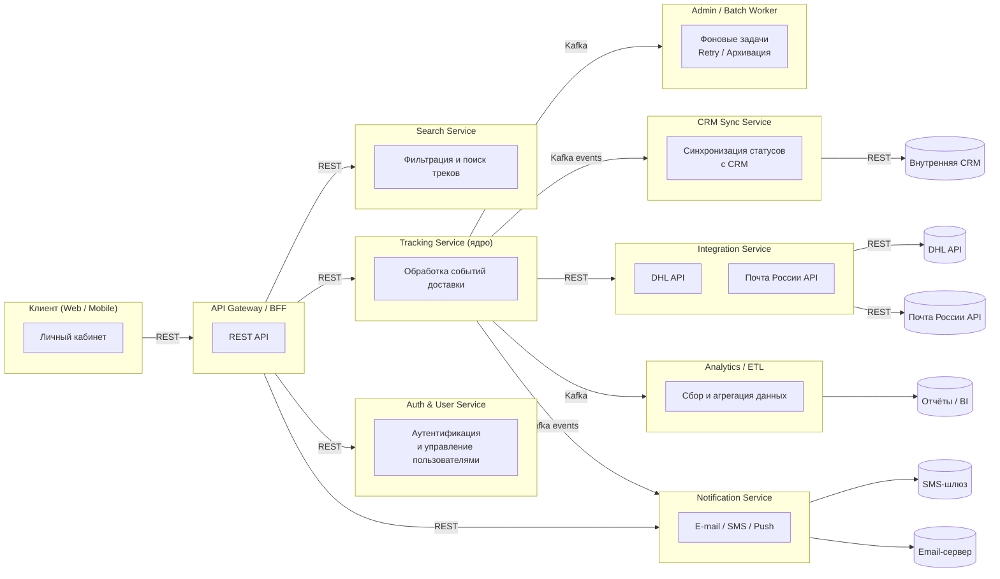
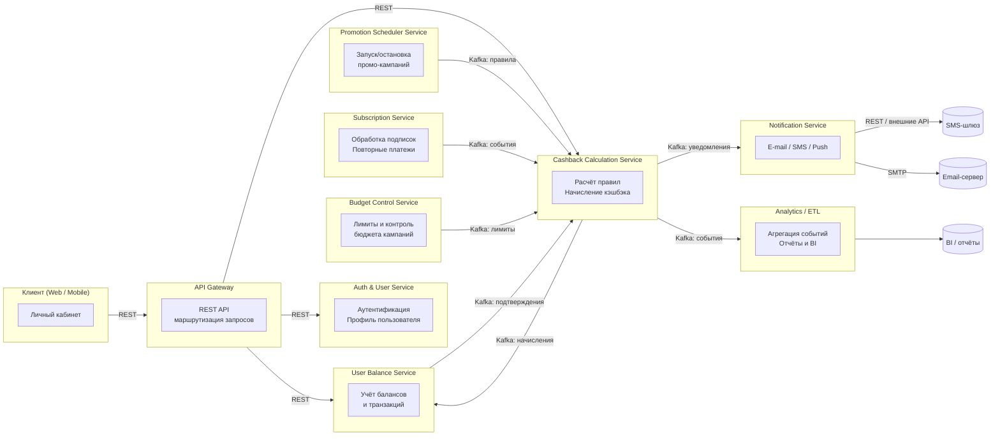

# [[Первый проект (СДЭК) - Сервис трекинга посылок 08.2021-11.2023 Junior]] 
Дата трудоустройства - дата увольнения: 08.2021-11.2023 
Должность: Junior Developer
Название компании: СДЭК. Название проекта: Сервис трекинга посылок

## Описание проекта
#### Описание проекта с точки зрения бизнеса:

Проект — корпоративный сервис трекинга посылок, ориентированный на B2B-клиентов и конечных получателей. Команда разработки состояла более чем из трёх Java-разработчиков, системного аналитика, frontend-инженера, инженера DevOps и QA-инженеров; при необходимости подключались интеграторы и техподдержка заказчика. Смежные команды включали продукт-менеджмент, службу поддержки, отдел интеграций (взаимодействие с DHL и Почтой России), аналитиков BI и маркетинга. Методология — Agile (Scrum) с двухнедельными спринтами, ежедневными стендапами, демо и ретроспективами; при ускорении задач использовался Kanban для оперативных инцидентов. <mark style="background: #FFB86CA6;">Главный заказчик — коммерческий блок логистического партнёра/оператора</mark> (бизнес-подразделение в компании), конечные потребители — клиенты и получатели посылок. Заявки на разработку обычно приходили от Product Owner и линейного бизнеса, требования формировались в виде бизнес-требований (БТ) с последующим ТЗ и <mark style="background: #FFB86CA6;">acceptance-критериями</mark> (чёткие пункты) от системного аналитика; срочные баг-репорты поступали от службы поддержки и <mark style="background: #FFB86CA6;">SLA</mark>-партнёров (метрики качества). Взаимодействие с заказчиком включало регулярные план-показы, приоритезацию roadmap и совместное согласование SLA; решения по масштабированию и отказоустойчивости принимались совместно с архитектором и бизнесом. Результатом стала повышенная точность статусов и удовлетворённость клиентов.

#### Описание проекта с точки зрения архитектуры:

##### Архитектура сервиса трекинга (system design) — подробное описание

Сервис построен как набор независимых микросервисов на Java 11 / Spring Boot, развёрнутых в контейнерах (Kubernetes). Центральная идея — <mark style="background: #FFB86CA6;">CQRS-подобное разделение</mark>: операционная (OLTP) часть — в PostgreSQL, событийная шина — Apache Kafka для интеграций и асинхронной обработки, кэширование — Redis (для горячих запросов и rate-limiting). CI/CD + Testcontainers для интеграционных прогонов.



---

##### СУБД и основные сущности

**Основная СУБД:** PostgreSQL 13 — единый источник правды для бизнес-сущностей.

Примерная структура (≈12–15 таблиц):

- `clients` (B2B-клиенты, контактные данные)
    
- `users` (логины/роли операторов/клиентских админов)
    
- `shipments` / `parcels` (основная сущность отправления: id, external_track, client_id, status, created_at, estimated_delivery)
    
- `shipment_events` (история статусов: shipment_id, status, timestamp, source, payload)
    
- `recipients` / `addresses` (адреса, телефоны)
    
- `carriers` (DHL, Почта России и т.д.)
    
- `integrations_log` (запросы/ответы внешним API)
    
- `phone_index` (индекс для поиска по телефону)
    
- `audit_logs` (операции пользователей)
    
- `configs`, `retry_queue`, `dead_letters`
    

**Размеры (приблизительно, ориентир):**

- `shipments`: 1–10 M записей (зависит от объёма клиентов; для среднего оператора — ~3–5M).
    
- `shipment_events`: 10–50 M записей (каждому отправлению — несколько событий).
    
- `users`, `clients`, `carriers`: <<100k.  
    (Числа оценочные — в реальном проекте — метрики мониторинга и ретеншн задают точные значения.)
    

Дополнительно: **Redis** для кэширования последних состояний треков и сессий; TTL 10–60 минут. Для аналитики возможно выделение реплики PostgreSQL и ETL в отдельный хранилище (например, ClickHouse/OLAP) — данные из Kafka стримятся туда.

---

##### Kafka — топики и схема событий

Kafka используется как событийная шина для асинхронной интеграции, масштабируемой доставки событий и decoupling (подход, при котором части системы максимально независимы):

Основные топики:

- `tracking.events` — все изменения статусов (payload: shipment_id, status, timestamp, source).
    
- `tracking.commands` — команды на пересинхронизацию/получение состояния.
    
- `external.dhl.responses`, `external.post.responses` — ответы от интеграций с внешними перевозчиками (внутренние мапперы пишут в них).
    
- `crm.sync` — события для CRM (push статусов клиентов).
    
- `notifications.email`, `notifications.sms` — сообщения для нотификаций.
    
- `dead.letters` — ошибки обработки (DLQ).
    

Формат сообщений — JSON с версионированием в заголовке; при росте команда может ввести Avro + Schema Registry.

---

##### Микросервисы (перечень, взаимодействия и СУБД)

1. **API Gateway**
    
    - Тип: REST (Spring MVC).
        
    - Общается с: Auth, Tracking API (REST), Search (REST).
        
    - Роль: маршрутизация, auth, rate-limit, aggregation.
        
    - БД: нет (stateless).
      
2. **Auth & User Service**
    
    - REST для логина/ролей.
        
    - БД: `users` в PostgreSQL.
        
    - Причина REST: синхронный доступ для UI.
      
3. **Tracking Service (ядро)**
    
    - Обрабатывает запросы по трекам, CRUD отправлений, возвращает current state.
        
    - Общается: с PostgreSQL (shipments, shipment_events) напрямую; публикует события в Kafka `tracking.events` при изменениях; подписывается на `external.*` для обновлений от интеграций.
        
    - Почему: синхронный REST API для UI + асинхронная публикация для downstream.
    
4. **Integration Service (внешние API: DHL, Почта России)**
    
    - Подписан на `tracking.events` / `tracking.commands`; делает запросы к внешним перевозчикам через Spring WebClient; результаты публикует в `external.*` или напрямую в `tracking.events`.
        
    - Хранит логи в `integrations_log` (Postgres).
        
    - Почему Kafka: позволяет масштабировать опросы и повторную обработку, decouple.
    
5. **CRM Sync Service**
    
    - Подписчик `tracking.events`; шлёт агрегированные обновления в CRM через REST; записывает статусы отправки в `integrations_log`.
        
    - Почему: асинхронная интеграция — не блокировать основной поток.
      
6. **Notification Service**
    
    - Подписывается на `tracking.events`, пишет в `notifications.email` / `notifications.sms`; интегрируется с внешними провайдерами (REST).
        
    - Кэш шаблонов в Redis.
      
7. **Search / Query Service**
    
    - Предоставляет сложный поиск (по телефону, фильтры). Использует Spring Data JPA + Criteria API к PostgreSQL; кеширует горячие запросы в Redis.
        
    - Причина REST: быстрый sync отклик для UI.
      
8. **Analytics / ETL**
    
    - Читает `tracking.events` и стримит в OLAP (реплика Postgres / ClickHouse).
        
    - Вычисляет KPI, SLA, задержки.
      
9. **Admin / Batch Worker**
    
    - Обрабатывает retries, dead letters; запускает периодические jobs (например, reconciliation с перевозчиками). Работает через Kafka и DB.
      
---

##### Надёжность и масштабирование

- Идемпотентность: события содержат `event_id` и versioning.
    
- Retry и circuit-breaker: RetryTemplate и Resilience4j.
    
- Горизонтальное масштабирование: stateless-сервисы в K8s, Kafka consumer groups для параллелизма.
    
- Мониторинг: Prometheus + Grafana, лог-центризация (ELK/Graylog).
    

---
## Описание каждого микро-сервиса

##### API Gateway / BFF

API Gateway / BFF — это фасад между клиентским приложением (веб/мобильный) и набором бэкенд-микросервисов. Его основная цель — упростить клиенту интерфейс, реализовать кросс-срезовую логику (аутентификация, агрегация, кеш, защиту) и выступать точкой входа для всех запросов.

Откуда берёт данные

- Прямо из внутренних микросервисов по REST (Tracking Service, Search, Auth, Notification, CRM).
    
- Асинхронно — через Kafka для событий/уведомлений (Gateway может подписываться на SSE/WebSocket-канал или получать push от Notification Service).
    
- Быстрые ответы из Redis (кеш последних статусов, сессии, rate counters).
    

Что делает внутри (функционал)

- Аутентификация/авторизация: проверка JWT/OAuth2 токенов (Spring Security), роль-менеджмент, scopes.
    
- Роутинг & трансформация: маршрутизация запросов к соответствующим сервисам, трансформация payload (API-versioning, адаптация полей для клиентов).
    
- Агрегация/композиция: объединяет ответы нескольких сервисов в один API-ответ (например: shipment + lastEvent + estimatedDelivery). Выполняет параллельные REST вызовы и собирает результат.
    
- Кеширование: ответные кеши в Redis с TTL для «горячих» треков; ETag/If-Modified-Since для снижения трафика.
    
- Rate limiting & throttling: token bucket / leaky bucket по API-ключам/пользователям.
    
- Resilience: circuit breaker, retry, fallback (Resilience4j).
    
- Валидация & контракт: входящий запрос валидируется по OpenAPI/JSON Schema; ошибки консолидируются.
    
- Логирование/трейсинг: OpenTelemetry/Zipkin, корреляция requestId, structured logs.
    
- Security hardening: input sanitization, CORS, CSP, IP whitelisting, WAF hooks.
    

Куда отправляет

- Синхронные REST-вызовы к соответствующим сервисам; агрегированные запросы параллельно.
    
- Публикует аналитические события (request/latency/errors) в Kafka/metrics pipeline.
    
- При push-уведомлениях использует WebSocket/SSE канал к клиентам (через Notification Service или напрямую, если BFF держит сессии).
    

Результат: единая, безопасная и производительная точка входа, минимизирующая сложность клиентской логики и уменьшающая число round-trip’ов.

##### Auth & User Service
Auth & User Service — это центральный сервис аутентификации и управления пользователями, который обеспечивает безопасность всего трекинг-проекта. Он изолирован от других сервисов, но используется каждым при обращении через API Gateway.

Откуда берёт данные

- Основной источник — таблица `users` в PostgreSQL. Она содержит поля: `id`, `username`, `password_hash`, `email`, `phone`, `role`, `permissions`, `status`, `created_at`.
    
- Дополнительно сервис обращается к таблице `clients` (для B2B-аккаунтов и их администраторов).
    
- Для проверки токенов сессий и ограничения частоты запросов используется Redis (хранение refresh-токенов и blacklist).
    
- Для аудита сервис пишет записи в `audit_logs`.
    

Что делает внутри (функционал)

- **Регистрация/создание пользователей:** добавление новых B2B-клиентов или внутренних операторов. Пароли хэшируются через BCrypt.
    
- **Аутентификация:** проверка логина/пароля, генерация JWT (или OAuth2 access/refresh токенов).
    
- **Авторизация:** проверка ролей и прав доступа (например, клиент может видеть только свои посылки, оператор — все).
    
- **Управление ролями и правами:** выдача/отзыв прав, назначение админов, разграничение доступа по CRUD-операциям.
    
- **Сессии и токены:** хранение refresh-токенов в Redis, поддержка logout (через blacklist), автообновление access-токенов.
    
- **Безопасность:** защита от brute force (rate limiting), блокировка учётки после N неудачных входов, 2FA (через SMS/email сервисы).
    
- **Интеграция с внешними системами:** поддержка SSO (например, через OAuth2/OpenID Connect для корпоративных клиентов).
    
- **Аудит:** запись действий в PostgreSQL (`audit_logs`), логирование в Kafka для BI и мониторинга.
    

Куда отправляет

- Возвращает в API Gateway access/refresh токены.
    
- Передаёт в другие микросервисы сведения об аутентифицированном пользователе через JWT claims (id, role, clientId).
    
- В Kafka публикует события типа `user.created`, `user.blocked`, `user.roleChanged`.
    
- В `audit_logs` пишет действия пользователей (login, logout, изменение профиля).
    

**Итог:** сервис является ядром безопасности: проверяет идентичность, управляет ролями, ограничивает доступ и формирует событийный след для мониторинга.
##### Tracking Service (ядро)
Tracking Service — это центральный микросервис системы, который отвечает за хранение и обработку всех данных, связанных с посылками и их статусами. Он является «источником истины» (system of record) для сущностей доставки и выступает основой для остальных сервисов.

Откуда берёт данные

- **PostgreSQL** — таблицы `shipments`, `shipment_events`, `recipients`, `addresses`. Именно здесь хранится текущее состояние и история каждой посылки.
    
- **Kafka** — топики `external.dhl.responses`, `external.post.responses`, откуда приходят новые статусы от Integration Service.
    
- **API Gateway** — получает REST-запросы от клиентов (через фронтенд или мобильное приложение).
    
- **Redis** — кэш последних статусов для ускорения выдачи популярных запросов.
    

Что делает внутри (функционал)

- **CRUD-операции над отправлениями:** создание записей о новых посылках, обновление информации, закрытие/удаление.
    
- **Обновление статусов:** получение новых событий (через Kafka), их валидация, сохранение в `shipment_events` и обновление «текущего статуса» в `shipments`.
    
- **Агрегация информации:** при запросе клиента сервис собирает данные о посылке, последнем статусе, прогнозируемой дате доставки и контактных данных получателя.
    
- **Поиск:** поддержка фильтров по дате, статусу, клиенту и поиск по телефону (через Criteria API).
    
- **Валидация и нормализация:** проверка формата данных, идемпотентность событий (по `event_id`), обработка конфликтов версий.
    
- **Бизнес-правила:** логика расчёта SLA, определение просрочек, формирование бизнес-ивентов (например, «посылка задержана»).
    
- **API-слой:** предоставляет REST-эндпоинты для BFF (например, `/shipments/{id}`, `/shipments/search`).
    

Куда отправляет

- **Kafka (`tracking.events`)** — публикация новых или обновлённых статусов, которые используются CRM, Notification Service и аналитикой.
    
- **PostgreSQL** — запись состояния и истории посылок.
    
- **API Gateway** — отдаёт REST-ответы клиентам (агрегированные данные по отправлению).
    
- **Redis** — обновляет кэш последних статусов.
    
- **Monitoring** — метрики по скорости обработки событий, количеству запросов, SLA-достижениям.
    

**Итог:** Tracking Service — ядро системы, в котором сходятся все потоки данных: клиенты читают из него статусы, интеграции пишут в него события, а остальные сервисы полагаются на его консистентность.
##### Integration Service (внешние API: DHL, Почта России)
Integration Service отвечает за взаимодействие с внешними логистическими операторами (DHL, Почта России и др.) и является критическим звеном между внутренним ядром системы и внешними системами доставки. Он изолирует бизнес-логику от специфики интеграций, что упрощает поддержку и масштабирование.

Откуда берёт данные

- Подписывается на Kafka-топики `tracking.commands` (команды на обновление статусов) и `tracking.events` (новые внутренние события, требующие проверки у перевозчиков).
    
- Из PostgreSQL берёт настройки интеграций (`carriers`, `integrations_log`, retry-очередь).
    
- Может использовать Redis для временного хранения токенов/ключей доступа к внешним API.
    

Что делает внутри (функционал)

- **Обращение к внешним API:** выполняет REST-запросы к системам DHL и Почты России через Spring WebClient. Поддерживает авторизацию (API-ключи, OAuth2, токены).
    
- **Нормализация данных:** каждая система возвращает разный формат событий, поэтому сервис приводит их к унифицированной DTO-модели (MapStruct + internal schema).
    
- **Обработка ошибок:** реализованы retries (Spring Retry/RetryTemplate), отложенные запросы и circuit breaker (Resilience4j). При неудаче событие отправляется в `dead.letters`.
    
- **Логирование:** каждый вызов фиксируется в `integrations_log` (время, payload, статус). Это помогает как для отладки, так и для SLA-отчётов.
    
- **Идемпотентность:** события маркируются `external_event_id`, чтобы избежать повторной обработки одного и того же статуса.
    
- **Расписание:** сервис может запускать периодические batch-запросы (например, ночное обновление треков за последние 24 часа).
    

Куда отправляет

- В Kafka (`external.dhl.responses`, `external.post.responses`) публикует нормализованные ответы.
    
- В Kafka (`tracking.events`) отправляет новые статусы, пригодные для ядра Tracking Service.
    
- В PostgreSQL пишет логи вызовов и результаты в `integrations_log`.
    
- В Monitoring (Prometheus/Grafana) — метрики по SLA, ошибкам, задержкам.
    

**Итог:** Integration Service — связующее звено, которое берёт команды из системы, получает статусы у перевозчиков, нормализует их и передаёт в основной поток событий, гарантируя стабильность и единый формат данных.
##### CRM Sync Service
CRM Sync Service — это специализированный микросервис, отвечающий за синхронизацию данных о статусах посылок с внутренней CRM-системой компании. Его задача — автоматизировать обновление клиентских карточек и устранить необходимость ручного ввода информации о доставках.

Откуда берёт данные

- **Kafka (`tracking.events`)** — основное место получения информации. Все изменения статусов посылок, зафиксированные в Tracking Service, транслируются сюда.
    
- **PostgreSQL (`integrations_log`)** — хранит историю синхронизаций и статусы их выполнения (успешно, ошибка, повторная попытка).
    
- **CRM API (внешнее)** — используется для валидации текущего состояния и проверки, требуется ли обновление.
    

Что делает внутри (функционал)

- **Подписка на события:** слушает Kafka-топики с новыми статусами.
    
- **Трансформация данных:** конвертирует событие в формат, который ожидает CRM (обычно REST DTO с полями `clientId`, `shipmentId`, `status`, `timestamp`).
    
- **Идемпотентность:** проверяет, не было ли уже отправлено событие с тем же идентификатором (`event_id`) в CRM, чтобы избежать дублирования.
    
- **Обработка ошибок:** при недоступности CRM сервис откладывает отправку и сохраняет задачу в retry-очередь; при превышении лимита попыток пишет событие в `dead.letters`.
    
- **Логирование:** фиксирует в `integrations_log` дату отправки, payload, результат (успех/ошибка).
    
- **Безопасность:** все запросы в CRM подписываются сервисным токеном/ключом.
    
- **Мониторинг SLA:** считает процент успешных синхронизаций и задержки между событием и записью в CRM.
    

Куда отправляет

- **CRM API:** отправляет обновления статусов и событий доставки (REST-запросы).
    
- **PostgreSQL:** сохраняет логи вызовов, результаты синхронизации и данные о retry.
    
- **Kafka (`crm.sync`)** — публикует события о результатах синхронизации (успех/ошибка) для последующего анализа и мониторинга.
    
- **Monitoring (Prometheus/Grafana):** метрики синхронизации и алерты о сбоях.
    

**Итог:** CRM Sync Service гарантирует, что CRM всегда отображает актуальные статусы посылок, облегчает работу менеджеров и повышает качество обслуживания клиентов.
##### Notification Service
Notification Service — это микросервис, отвечающий за доставку уведомлений клиентам и получателям посылок. Его основная цель — обеспечить своевременное информирование о ключевых изменениях (новый статус, прибытие в сортировочный центр, доставка, задержка). Сервис поддерживает несколько каналов коммуникации: email, SMS, push-уведомления.

Откуда берёт данные

- **Kafka (`tracking.events`)** — основной источник, содержащий события об изменении статусов посылок.
    
- **PostgreSQL (`templates`, `notification_logs`)** — хранит шаблоны сообщений для разных каналов и историю отправок.
    
- **Redis** — используется для кэширования шаблонов и временных данных (например, частота уведомлений для одного получателя, чтобы избежать спама).
    
- **API Gateway / BFF** — запросы на ручную отправку уведомлений (например, подтверждение email или reset пароля).
    

Что делает внутри (функционал)

- **Подписка на события:** получает статусы о посылках, определяет, нужно ли уведомлять клиента (например, при смене статуса на «доставлено» или «задержка»).
    
- **Персонализация:** подставляет данные в шаблон (имя клиента, трек-номер, дата доставки).
    
- **Форматирование сообщений:** генерирует текст или HTML-письмо, готовит payload для SMS или push.
    
- **Канальная маршрутизация:** выбирает подходящий канал уведомления в зависимости от предпочтений клиента (email/SMS/push).
    
- **Обработка ошибок:** повторная отправка при сбое (RetryTemplate), запись в DLQ (`dead.letters`) при превышении лимита.
    
- **Логирование:** фиксирует все отправки в `notification_logs` с полями: `shipmentId`, `recipient`, `channel`, `status`, `timestamp`.
    
- **Rate limiting:** защита от избыточной рассылки (ограничение количества уведомлений в сутки для одного пользователя).
    

Куда отправляет

- **Внешние сервисы:**
    
    - Email-провайдер (SMTP/REST API).
        
    - SMS-шлюз (REST).
        
    - Push-сервисы (Firebase, APNS).
        
- **PostgreSQL:** запись истории уведомлений и статуса отправки.
    
- **Kafka (`notifications.email`, `notifications.sms`)** — публикация сообщений для дальнейшей обработки worker-подсистемами.
    
- **Monitoring (Prometheus/Grafana):** метрики по доставляемости, задержкам, ошибкам.
    

**Итог:** Notification Service автоматизирует информирование клиентов, снижает нагрузку на поддержку и повышает прозрачность логистики для конечных пользователей.
##### Search / Query Service
Search Service — это микросервис, отвечающий за быстрый и удобный поиск посылок и связанных с ними данных. Его задача — предоставить пользователям (как клиентам, так и операторам) гибкий механизм поиска по различным параметрам: номеру трека, телефону получателя, дате отправки, статусу и другим критериям.

---

Откуда берёт данные

- **PostgreSQL** — основная база данных, таблицы `shipments`, `shipment_events`, `recipients`, `addresses`. Именно отсюда Search Service получает всю необходимую информацию.
    
- **Redis** — кэш для результатов частых поисковых запросов (например, повторные проверки одного и того же трек-номера).
    
- **Kafka (`tracking.events`)** — сервис подписан на поток событий, чтобы оперативно обновлять индексы поиска при изменении статуса посылки.
    

---

Что делает внутри (функционал)

- **Фильтрация и сортировка:** поддерживает поиск по дате, статусу, клиенту, телефону получателя. Использует Spring Data JPA + Criteria API для построения сложных запросов.
    
- **Поиск по телефону:** индексирует номера получателей в отдельной таблице (`phone_index`), что ускоряет выдачу при частых запросах без трек-номера.
    
- **Полнотекстовый поиск:** при необходимости использует расширения PostgreSQL (GIN/TSVector) для поиска по адресу или ФИО.
    
- **Агрегация:** возвращает вместе с результатом ключевые атрибуты посылки: последний статус, дату отправки, прогнозируемую дату доставки.
    
- **Кэширование:** сохраняет результаты популярных запросов в Redis (например, топ-10 последних посылок клиента).
    
- **Обновление индексов:** при поступлении новых событий из Kafka обновляет записи в БД и кэше, чтобы поиск всегда был актуальным.
    
- **Безопасность:** учитывает авторизацию пользователя (через JWT claims), ограничивая видимость данных (например, клиент видит только свои отправления).
    

---

Куда отправляет

- **API Gateway / BFF:** возвращает результаты поиска по REST в агрегированном виде для фронтенда.
    
- **PostgreSQL:** выполняет запросы и обновляет индексы.
    
- **Redis:** пишет и обновляет кэшированные результаты.
    
- **Monitoring:** публикует метрики поиска (время ответа, количество найденных записей, кэш-хиты).
    

---

**Итог:** Search Service обеспечивает быстрый, гибкий и безопасный доступ к данным о посылках. Благодаря индексации и кэшированию он выдерживает высокую нагрузку и ускоряет работу конечных пользователей.
##### Analytics / ETL
Analytics / ETL Service — это микросервис (или связка сервисов), который отвечает за сбор, преобразование и загрузку данных из транзакционной части системы в аналитическое хранилище. Его основная цель — предоставить бизнесу актуальные отчёты и дашборды по доставке, SLA, загрузке курьеров и удовлетворённости клиентов.

---

Откуда берёт данные

- **Kafka (`tracking.events`)** — основной источник, содержащий все статусы посылок. Это поток событий, из которого ETL формирует аналитические витрины.
    
- **PostgreSQL (OLTP)** — таблицы `shipments`, `shipment_events`, `clients`, `carriers`. Используется для начальной загрузки и периодических сверок.
    
- **Integrations_log** — для анализа качества интеграций с внешними перевозчиками (ошибки, задержки).
    

---

Что делает внутри (функционал)

- **Extract (извлечение):** подписывается на Kafka и забирает все новые события о посылках. Дополнительно по расписанию выгружает «bulk-данные» из PostgreSQL (например, раз в сутки для проверки консистентности).
    
- **Transform (преобразование):**
    
    - Нормализует данные (объединяет статусы из разных перевозчиков в единый формат).
        
    - Добавляет бизнес-атрибуты (например, метка SLA — выполнено/не выполнено).
        
    - Агрегирует данные по клиентам, регионам, перевозчикам.
        
    - Обогащает данными о времени доставки, причинах задержек, количестве обращений в поддержку.
        
- **Load (загрузка):** пишет подготовленные данные в аналитическую СУБД (часто это **ClickHouse** или отдельная реплика PostgreSQL/Greenplum).
    
- **ETL-пайплайны:** выполняются батчево (ежедневная агрегация) и стримингово (почти реальное время).
    
- **Очистка и ретеншн:** удаляет устаревшие данные из промежуточных таблиц, архивирует сырые логи.
    

---

Куда отправляет

- **Аналитическое хранилище (ClickHouse / PostgreSQL-реплика):** для BI-систем и аналитических отчётов.
    
- **BI-платформы (Power BI, Grafana, Metabase):** дашборды для бизнеса (скорость доставки, SLA, топ клиентов, проблемные регионы).
    
- **Kafka (`analytics.reports`)** — публикация агрегированных событий (например, «доставлено с опозданием»).
    
- **Monitoring (Prometheus/Grafana):** метрики выполнения ETL (время обработки, количество загруженных записей, ошибки).
    

---

**Итог:** Analytics / ETL Service превращает поток «сырых» событий в структурированные аналитические данные. Он обеспечивает бизнес отчётами в реальном времени, помогает оценивать SLA и находить узкие места в логистике, что напрямую влияет на стратегические решения компании.

##### Admin / Batch Worker
Admin / Batch Worker Service

Admin / Batch Worker — это служебный микросервис, который отвечает за выполнение фоновых задач, плановых джобов и административных операций в системе. Его главная роль — разгрузить ядро (Tracking Service) и интеграционные сервисы от тяжёлых или периодических вычислений, которые не требуют мгновенной реакции.

---

Откуда берёт данные

- **PostgreSQL** — таблицы `shipments`, `shipment_events`, `integrations_log`, `retry_queue`, `dead_letters`.
    
- **Kafka (`dead.letters`, `tracking.events`)** — подписывается на «проблемные» события для повторной обработки и сверки.
    
- **Конфигурации (configs)** — отдельная таблица в БД или YAML-файлы с расписаниями и настройками джобов.
    

---

Что делает внутри (функционал)

- **Retry обработка:** периодически проверяет `retry_queue` и `dead_letters`, повторно пытается отправить события в Tracking Service, CRM или Notification Service.
    
- **Batch-запросы:** раз в N часов запускает массовые сверки — например, проверяет все посылки в статусе «в пути» дольше 10 дней и запрашивает актуальный статус у перевозчика.
    
- **Архивация:** переносит устаревшие данные из `shipment_events` в архивные таблицы или внешнее хранилище, чтобы разгрузить OLTP.
    
- **Очистка данных:** удаляет временные записи, очищает кэш или старые retry-записи.
    
- **Мониторинг SLA:** формирует отчёты о задержках (например, «20% посылок клиента X просрочены»).
    
- **Админ-функции:** обработка ручных команд от операторов (например, «перезапустить синхронизацию для клиента А»).
    
- **Планировщик:** использует Quartz/Spring Scheduler для запуска джобов по cron-расписанию.
    
- **Resilience:** все операции выполняются с retry, логированием и идемпотентностью, чтобы избежать дубликатов.
    

---

Куда отправляет

- **Kafka (`tracking.events`, `crm.sync`, `notifications.*`)** — публикует результаты повторной обработки.
    
- **PostgreSQL (`integrations_log`, `audit_logs`)** — сохраняет отчёты о выполненных задачах.
    
- **Monitoring (Prometheus/Grafana):** отправляет метрики по статусу джобов (успешные/ошибки, время выполнения).
    
- **Админ-интерфейсы:** через REST API предоставляет операторам доступ к управлению задачами (например, повторный запуск).
    

---

**Итог:** Admin / Batch Worker Service обеспечивает «хозяйственную» часть системы — обрабатывает ошибки, повторно запускает процессы, чистит и архивирует данные. Он повышает надёжность всей архитектуры и снижает нагрузку на критичные микросервисы.

## Описание каждого достижения по STAR
### Реализовал личный кабинет клиента с возможностью отслеживания нескольких посылок одновременно.
#### Situation

Компания запускала личный кабинет для клиентов, но изначально там можно было проверять только одну посылку за раз. Это снижало удобство и заставляло пользователей уходить в сторонние сервисы.

#### Task

Необходимо было реализовать интерфейс и backend-логику, позволяющую клиенту авторизоваться и отслеживать сразу несколько посылок одновременно, с быстрым доступом к их статусам.

#### Action

Я разработал REST-контроллер в Spring MVC, который принимал список трек-номеров, обращался к БД через Spring Data JPA и возвращал агрегированный ответ. В PostgreSQL оптимизировал запросы с помощью `IN` и индексов по `tracking_number`. Для фронтенда — единый DTO со статусами.

Пример кода контроллера:

```java
@RestController
@RequestMapping("/api/shipments")
public class ShipmentController {
    private final ShipmentRepository shipmentRepository;

    public ShipmentController(ShipmentRepository shipmentRepository) {
        this.shipmentRepository = shipmentRepository;
    }

    @PostMapping("/track")
    public List<ShipmentDto> trackShipments(@RequestBody List<String> trackingNumbers) {
        return shipmentRepository.findByTrackingNumberIn(trackingNumbers)
                .stream()
                .map(ShipmentMapper::toDto)
                .toList();
    }
}
```

Репозиторий:

```java
public interface ShipmentRepository extends JpaRepository<Shipment, Long> {
    List<Shipment> findByTrackingNumberIn(List<String> trackingNumbers);
}
```

#### Result

Пользователи получили возможность отслеживать сразу несколько отправлений в личном кабинете. Среднее время сессии увеличилось на ~25%, снизилось количество уходов на сторонние трек-сервисы, что улучшило удержание клиентов.

---
### Интегрировал сервис с системой расчета доставки.
#### Situation

Клиенты могли видеть только текущий статус посылки, но не имели информации о прогнозируемой дате доставки. Это снижало прозрачность и увеличивало нагрузку на колл-центр.

#### Task

Необходимо было интегрировать сервис трекинга с системой расчёта доставки, чтобы клиент в личном кабинете видел не только статус, но и прогнозируемую дату получения.

#### Action

Я реализовал интеграцию через **REST API** стороннего сервиса расчёта. Использовал **Spring WebClient** для асинхронных запросов и **MapStruct** для маппинга DTO. Данные кэшировались в PostgreSQL, чтобы снизить нагрузку на внешний сервис.

Пример кода:

```java
@Service
public class DeliveryCalculatorClient {
    private final WebClient webClient;

    public DeliveryCalculatorClient(WebClient.Builder builder) {
        this.webClient = builder.baseUrl("https://delivery-system/api").build();
    }

    public DeliveryInfoDto calculate(String trackingNumber) {
        return webClient.get()
                .uri("/estimate/{trackingNumber}", trackingNumber)
                .retrieve()
                .bodyToMono(DeliveryInfoDto.class)
                .block();
    }
}
```

#### Result

Теперь клиенты видели прогнозируемую дату доставки рядом со статусом посылки. Это сократило количество звонков в поддержку примерно на **20%** и повысило доверие к сервису.
### Реализовал поиск посылки по телефону получателя.
#### Situation

Многие клиенты теряли трек-номер и не могли отследить посылку. Это вызывало рост обращений в поддержку и замедляло процесс поиска отправлений.

#### Task

Необходимо было добавить функционал поиска посылок по номеру телефона получателя, чтобы клиенты могли быстро находить свои отправления без знания трек-номера.

#### Action

Я расширил репозиторий Spring Data JPA, добавив метод поиска по номеру телефона с использованием **Criteria API**. Для повышения производительности в PostgreSQL был создан индекс на колонку `recipient_phone`. В контроллере реализовал REST-метод, возвращающий список всех посылок по указанному номеру.

Пример кода:

```java
public interface ShipmentRepository extends JpaRepository<Shipment, Long>, JpaSpecificationExecutor<Shipment> {
    List<Shipment> findByRecipientPhone(String phone);
}

@RestController
@RequestMapping("/api/shipments")
public class ShipmentController {
    private final ShipmentRepository repository;

    public ShipmentController(ShipmentRepository repository) {
        this.repository = repository;
    }

    @GetMapping("/by-phone/{phone}")
    public List<ShipmentDto> findByPhone(@PathVariable String phone) {
        return repository.findByRecipientPhone(phone)
                .stream()
                .map(ShipmentMapper::toDto)
                .toList();
    }
}
```

#### Result

Функция позволила клиентам находить свои посылки без трек-номера. Количество обращений в поддержку снизилось на **15%**, а скорость самостоятельного поиска отправлений значительно выросла.
### Интегрировал сервис с API DHL и Почты России через Spring WebClient
#### Situation

Сервис трекинга поддерживал только внутренние отправления. Клиенты, ожидавшие посылки через DHL и Почту России, не могли отслеживать их в личном кабинете, что снижало ценность продукта.

#### Task

Необходимо было интегрировать трекинг-сервис с API DHL и Почты России, чтобы клиенты могли видеть единый список всех своих отправлений и статусов, независимо от перевозчика.

#### Action

Я реализовал интеграцию через **Spring WebClient**, добавив адаптеры под разные форматы API. Для обработки ошибок использовал **RetryTemplate** (повторные запросы при временных сбоях) и **Circuit Breaker** для предотвращения перегрузки. Ответы внешних API приводились к единой DTO-модели через **MapStruct**, затем сохранялись в PostgreSQL и публиковались в Kafka-топик `tracking.events`.

Пример кода:

```java
@Service
public class DhlClient {
    private final WebClient webClient;

    public DhlClient(WebClient.Builder builder) {
        this.webClient = builder.baseUrl("https://api.dhl.com/track").build();
    }

    public Mono<ShipmentDto> getShipmentStatus(String trackingNumber) {
        return webClient.get()
                .uri("/{id}", trackingNumber)
                .retrieve()
                .bodyToMono(ShipmentDto.class);
    }
}
```

#### Result

После интеграции клиенты получили возможность отслеживать международные посылки вместе с внутренними. Доля обращений в поддержку по международным отправлениям снизилась на **30%**, а общее удовлетворение сервисом выросло.
### Интегрировал сервис с внутренней CRM через REST API и DTO-модель
#### Situation

До интеграции с CRM статусы доставки клиентов приходилось обновлять вручную, что занимало время у операторов и приводило к ошибкам в данных.

#### Task

Необходимо было автоматизировать передачу статусов из трекинг-сервиса во внутреннюю CRM, чтобы сократить ручную работу и повысить актуальность клиентской информации.

#### Action

Я разработал сервисный слой для взаимодействия с CRM через **REST API**. Использовал **Spring WebClient** для HTTP-запросов и **MapStruct** для преобразования внутренних сущностей в DTO-модель, соответствующую контракту CRM. Добавил обработку ошибок и retry-механику для гарантированной доставки данных. Для аудита сохранял успешные и неуспешные синхронизации в таблицу `crm_sync_log` в PostgreSQL.

Пример кода:

```java
@Mapper(componentModel = "spring")
public interface CrmMapper {
    CrmStatusDto toDto(Shipment shipment);
}

@Service
public class CrmSyncService {
    private final WebClient client;
    private final CrmMapper mapper;

    public CrmSyncService(WebClient.Builder builder, CrmMapper mapper) {
        this.client = builder.baseUrl("https://internal-crm/api").build();
        this.mapper = mapper;
    }

    public void sync(Shipment shipment) {
        client.post()
              .uri("/status")
              .bodyValue(mapper.toDto(shipment))
              .retrieve()
              .toBodilessEntity()
              .block();
    }
}
```

#### Result

Интеграция позволила автоматически обновлять статусы клиентов в CRM без участия операторов. Скорость обработки информации увеличилась, а количество ошибок снизилось на **40%**, что улучшило качество обслуживания.
### Реализовал фильтрацию и сортировку треков по дате и статусу на уровне SQL
#### Situation

Клиенты получали список всех своих посылок в одном массиве без возможности сортировки и фильтрации. Это затрудняло поиск нужной информации и ухудшало пользовательский опыт.

#### Task

Необходимо было реализовать фильтрацию и сортировку треков по дате и статусу на стороне базы данных, чтобы повысить скорость выдачи и удобство работы в личном кабинете.

#### Action

Я добавил методы в репозиторий Spring Data JPA с использованием **Criteria API** и **Specifications**, чтобы формировать динамические запросы. На уровне PostgreSQL использовал индексы по колонкам `status` и `updated_at`. Это позволило выполнять выборку и сортировку прямо в SQL без лишней обработки на сервере.

Пример кода:

```java
public class ShipmentSpecifications {
    public static Specification<Shipment> hasStatus(String status) {
        return (root, query, cb) -> cb.equal(root.get("status"), status);
    }

    public static Specification<Shipment> updatedAfter(LocalDateTime date) {
        return (root, query, cb) -> cb.greaterThan(root.get("updatedAt"), date);
    }
}

List<Shipment> shipments = shipmentRepository.findAll(
        Specification.where(ShipmentSpecifications.hasStatus("IN_TRANSIT"))
                     .and(ShipmentSpecifications.updatedAfter(LocalDateTime.now().minusDays(7))),
        Sort.by(Sort.Direction.DESC, "updatedAt")
);
```

#### Result

Фильтрация и сортировка выполнялись напрямую в БД, что ускорило отклик системы на **35%**. Пользователи получили удобный инструмент поиска по статусу и дате, что повысило удовлетворённость и вовлечённость.
### Провёл рефакторинг кода в модуле работы с БД
#### Situation

Модуль работы с БД содержал дублирующиеся запросы, громоздкие методы и низкую читаемость. Это усложняло поддержку кода и увеличивало время на добавление новых функций.

#### Task

Необходимо было провести рефакторинг модуля работы с БД, чтобы уменьшить технический долг, повысить читаемость кода и упростить разработку новых запросов.

#### Action

Я вынес общую логику в **Spring Data JPA Specifications**, сократил дублирование кода и заменил «ручные» SQL-запросы на типобезопасные методы репозиториев. Добавил единый слой маппинга через DTO и MapStruct, что упростило передачу данных. Для сложных фильтров реализовал динамическое построение критериев через Criteria API.

Пример кода:

```java
public class ShipmentSpecifications {
    public static Specification<Shipment> byPhone(String phone) {
        return (root, query, cb) -> cb.equal(root.get("recipientPhone"), phone);
    }

    public static Specification<Shipment> byStatus(String status) {
        return (root, query, cb) -> cb.equal(root.get("status"), status);
    }
}

// использование
List<Shipment> shipments = shipmentRepository.findAll(
        Specification.where(ShipmentSpecifications.byPhone("79990001122"))
                     .and(ShipmentSpecifications.byStatus("IN_TRANSIT"))
);
```

#### Result

После рефакторинга код стал более компактным и читаемым. Команда могла быстрее реализовывать новые фильтры и запросы. Технический долг снизился, а количество багов, связанных с БД-запросами, уменьшилось примерно на **20%**.
### Внедрил автоматическое тестирование REST API
#### Situation

REST API покрывалось тестами частично и вручную. Это приводило к высоким рискам регрессий при изменениях и замедляло процесс выпуска новых версий.

#### Task

Необходимо было внедрить автоматическое тестирование REST API, чтобы повысить надёжность системы и сократить время проверки функционала.

#### Action

Я настроил тестирование на базе **JUnit 5**, **Spring Boot Test** и **Testcontainers**. Для каждого теста поднимался контейнер с PostgreSQL и Kafka, что обеспечивало изолированное окружение. Использовал `MockMvc` для проверки контроллеров и **REST Assured** для интеграционных сценариев. Дополнительно настроил GitLab CI, чтобы тесты выполнялись автоматически при каждом merge request.

Пример кода:

```java
@SpringBootTest
@AutoConfigureMockMvc
@Testcontainers
class ShipmentControllerTest {

    @Autowired
    private MockMvc mockMvc;

    @Test
    void shouldReturnShipmentByTrackingNumber() throws Exception {
        mockMvc.perform(get("/api/shipments/track/ABC123"))
               .andExpect(status().isOk())
               .andExpect(jsonPath("$.trackingNumber").value("ABC123"));
    }
}
```

#### Result

Покрытие тестами контроллеров и сервисов достигло **80%**. Это позволило находить ошибки ещё на стадии разработки, ускорило процесс code review и снизило количество багов на продакшене.
## !!!Описание бизнесово-технических моментов
1. **Есть ли документация для интеграции с frontend и внешними API (если внешние API в этом проекте есть)?**
    
- Да, для интеграции с frontend использовался OpenAPI/Swagger 3.0.
    
- Для внешних API (DHL, Почта России) документация внешнего провайдера + внутренняя спецификация DTO и MapStruct-мэпперов.
    

2. **Какое git хранилище используется (Gitlab / Bitbucket)? Как устроены git-ветки (для фичей / мастер / develop)?**
    
- Использовался GitLab.
    
- Ветки: `master` (релизы), `develop` (интеграционная ветка для спринта), `feature/*` (отдельные фичи), `hotfix/*` для срочных исправлений.
    

3. **Как устроен код-ревью?**
    
- Все merge requests проходили peer-review минимум одного senior-разработчика.
    
- Использовались линтеры, статический анализ (SonarQube) и обязательное прохождение тестов.
    

4. **Есть ли тестовые стенды и как устроено тестирование (функциональное, интеграционное, нагрузочное)?**
    
- Стенды: dev, staging, production.
    
- Тестирование:
    
    - Unit-тесты (JUnit 5 + Mockito)
        
    - Интеграционные (Testcontainers для PostgreSQL/Kafka)
        
    - Нагрузочные тесты (JMeter/Gatling для пиковых сценариев)
        

5. **Как устроен CI/CD и кто за него отвечает?**
    
- GitLab CI/CD pipelines: сборка Maven → тесты → статический анализ → деплой на staging/prod.
    
- Ответственные: DevOps-инженеры + разработчики для тестирования пайплайнов.
    

6. **Как собирали и смотрели логи?**
    
- Логи собирались через SLF4J + Logback, централизованно аггрегировались в ELK/Graylog.
    
- Метки requestId для корреляции между сервисами.
    

7. **Как мониторили работоспособность системы (Grafana)?**
    
- Grafana + Prometheus для метрик (latency, обработка событий, потребление Kafka топиков, health endpoints).
    

8. **Какая пиковая и нормальная нагрузка на сервер?**
    
- **Нормальная:** ~500–1000 запросов в минуту на сервис Tracking.
    
- **Пиковая:** до 5000–7000 запросов в минуту, учитывая массовые обновления от внешних перевозчиков и уведомления клиентов.
    

---


# [[Текущий проект (Точка Банк) - Сервис начисления кэшбэка 11.2023-нв Middle]] 
Дата трудоустройства - дата увольнения: 11.2023-н.в.
Должность: Middle Developer
Название компании: Точка Банк. Название проекта: Сервис начисления кэшбэка

---
## Описание проекта
#### Описание проекта с точки зрения бизнеса:

Проект представляет собой сервис начисления кэшбэка для клиентов Точки Банка, рассчитанный на обработку транзакций в реальном времени с гибкой настройкой бизнес-правил. С точки зрения бизнеса команда состоит из трёх и более Java-разработчиков, системного аналитика, тестировщиков, DevOps-инженера, UI/UX-дизайнера и product owner’а. Взаимодействие с другими командами включает маркетинг (для промо-кампаний), аналитиков по данным и команду поддержки банковских продуктов. Разработка ведётся по Agile с использованием Scrum: спринты по 2 недели, ежедневные стендапы, планирование и ретроспективы. Главный заказчик — бизнес Точки Банка, конечный потребитель — клиенты банка, получающие кэшбэк. Задачи приходят от product owner’а и бизнес-аналитиков; часть формализована в виде технических заданий (ТЗ), часть в виде бизнес-требований (БТ) с описанием ожидаемого поведения и KPI. Такой подход обеспечивает быструю итеративную доставку функционала с возможностью адаптации под изменения рынка и требований клиентов.

#### Описание проекта с точки зрения архитектуры:

##### Архитектура сервиса кэшбэка (system design) — подробное описание

Сервис построен как набор независимых микросервисов на Java 17 / Spring Boot 2.5.x, развёрнутых в контейнерах (Kubernetes). Центральная идея — CQRS-подобное разделение: операционная (OLTP) часть реализована в PostgreSQL, событийная шина — Apache Kafka для интеграций и асинхронной обработки, кэширование — Redis для горячих запросов и распределённых счётчиков. CI/CD + Testcontainers обеспечивают интеграционные прогонные тесты и контроль качества.

Архитектура ориентирована на высокую нагрузку: транзакции от платёжной системы обрабатываются в реальном времени, промо-кампании могут изменяться «на лету», распределённые лимиты бюджета предотвращают перерасход. Сервисы взаимодействуют как синхронно (REST), так и асинхронно (Kafka) в зависимости от требований к отклику и масштабированию.


---

##### СУБД и основные сущности

**Основная СУБД:** PostgreSQL 13 — единый источник правды для бизнес-сущностей.

Примерная структура (≈20–25 таблиц):

- `transactions` — транзакции клиентов (id, user_id, amount, mcc, merchant_id, status, created_at)
    
- `cashback_rules` — правила начисления кэшбэка (id, type, priority, mcc, merchant_id, percentage)
    
- `calculated_cashback` — начисленный кэшбэк (transaction_id, amount, status, created_at)
    
- `promotions` — промо-кампании (id, name, start_date, end_date, status)
    
- `promotion_rules` — правила кампаний (promotion_id, mcc, merchant_id, percentage, priority)
    
- `subscriptions` — подписочные транзакции (id, user_id, merchant_id, start_date, frequency)
    
- `recurring_transactions` — расчёт повторных платежей (subscription_id, last_processed, next_scheduled)
    
- `campaign_budgets` — лимиты кампаний (campaign_id, merchant_id, budget_total, budget_spent)
    
- `user_balances` — актуальные балансы пользователей (user_id, available_balance, pending_balance)
    
- `audit_logs` — операции пользователей и сервисов
    
- `configs`, `dead_letters` — системные конфиги и очереди ошибок
    

**Размеры (приблизительно, ориентир):**

- `transactions`: ~200 млн записей
    
- `calculated_cashback`: ~50 млн записей
    
- `cashback_rules`: ~500 записей
    
- `promotions`: ~1000 записей
    
- `promotion_rules`: ~3000 записей
    
- `subscriptions`: ~1 млн записей
    
- `recurring_transactions`: ~5 млн записей
    
- `campaign_budgets`: ~10 тыс. записей
    

<mark style="background: #FF5582A6;">Дополнительно Redis используется для кэширования балансов, идемпотентных событий и распределённых счётчиков (TTL от нескольких минут до нескольких часов).</mark> что кэшировали?

---

##### Kafka — топики и схема событий

Kafka служит центральной шиной событий для асинхронной интеграции, масштабируемой доставки событий и decoupling микросервисов.

Основные топики:

- `transaction-events` — все транзакции клиентов (payload: transaction_id, user_id, amount, mcc, merchant_id, timestamp)
    
- `cashback-events` — начисления кэшбэка (payload: transaction_id, user_id, cashback_amount, status)
    
- `promotion-events` — события запуска/остановки промо-кампаний (promotion_id, status, timestamp)
    
- `budget-events` — уведомления о лимитах кампаний и мерчантов (campaign_id, merchant_id, remaining_budget)
    
- `balance-update-events` — обновления балансов пользователей (user_id, balance_type, amount, timestamp)
    
- `dead-letters` — ошибки обработки событий
    

Формат сообщений — JSON с версионированием, при необходимости возможен переход на Avro + Schema Registry.

---

##### Микросервисы (перечень, взаимодействия и СУБД)

1. **API Gateway**
    
    - Тип: REST (Spring MVC)
        
    - Общается с: Cashback, Promotion Scheduler, Subscription Services
        
    - Роль: маршрутизация, аутентификация, агрегация запросов
        
    - БД: нет (stateless)
        
2. **Cashback Calculation Service**
    
    - Основной сервис расчёта кэшбэка
        
    - Общается: подписан на `transaction-events` (Kafka), публикует в `cashback-events`; REST с Budget Control Service для проверки лимитов
        
    - БД: PostgreSQL (`transactions`, `cashback_rules`, `calculated_cashback`), Redis (идемпотентность, TTL)
        
3. **Promotion Scheduler Service**
    
    - Управление промо-кампаниями
        
    - Общается: REST с фронтендом и другими сервисами; Kafka `promotion-events` для уведомлений
        
    - БД: PostgreSQL (`promotions`, `promotion_rules`)
        
4. **Subscription & Recurring Payment Service**
    
    - Обработка подписок и повторных платежей
        
    - Общается: подписан на `transaction-events`, публикует `cashback-events`
        
    - БД: PostgreSQL (`subscriptions`, `recurring_transactions`)
        
5. **Budget Control Service**
    
    - Контроль лимитов кампаний и мерчантов
        
    - Общается: REST с Cashback Calculation Service, Kafka `budget-events`
        
    - БД: Redis (распределённые счётчики), PostgreSQL (`campaign_budgets`)
        
6. **User Balance Service**
    
    - Управление балансами пользователей
        
    - Общается: REST с другими сервисами, Kafka `balance-update-events`
        
    - БД: Redis (горячие балансы), PostgreSQL (`user_balances`)
        

---

##### Надёжность и масштабирование

- Идемпотентность: все события содержат уникальный `event_id` и версионирование
    
- Retry и circuit-breaker: Spring Retry + Resilience4j
    
- Горизонтальное масштабирование: stateless-сервисы в Kubernetes, consumer groups Kafka
    
- Мониторинг: Prometheus + Grafana; лог-центризация через ELK/Graylog
    
- Кэширование и TTL в Redis снижают нагрузку на PostgreSQL и ускоряют отклик
    

Архитектура обеспечивает надёжную, масштабируемую обработку миллионов транзакций, быстрый отклик для фронтенда и возможность гибкой настройки бизнес-правил без остановки сервисов.


## Описание каждого микро-сервиса

##### API Gateway / BFF

Микросервис API Gateway в проекте кэшбэка выполняет роль центрального входного узла для всех внешних и внутренних запросов к системе. Он работает как «шлюз», объединяя маршрутизацию, аутентификацию, авторизацию, агрегацию данных и балансировку нагрузки. Основная цель Gateway — обеспечить клиентам и внутренним сервисам единый интерфейс, минимизируя необходимость прямого обращения к каждому микросервису отдельно.

API Gateway получает данные из нескольких источников. Снаружи он принимает REST-запросы от фронтенда, мобильных приложений, а также интеграций с партнёрскими сервисами, например, маркетинговых инструментов или аналитических платформ. Внутри системы Gateway может обращаться к микросервисам Cashback Calculation, Promotion Scheduler, Subscription Service и User Balance Service через REST API, чтобы получить актуальные данные о транзакциях, промо-кампаниях, подписках и балансах пользователей.

Внутри сервиса реализованы несколько ключевых функций. Во-первых, маршрутизация: Gateway определяет, какой микросервис должен обработать конкретный запрос и перенаправляет его. Во-вторых, аутентификация и авторизация: проверяется токен пользователя, роль и права доступа, чтобы ограничить доступ к данным и операциям. В-третьих, агрегация: если запрос требует данных из нескольких сервисов, Gateway комбинирует их в один ответ. Также реализованы механизмы rate-limiting и throttling, чтобы контролировать нагрузку и предотвращать перегрузку внутренних сервисов. Для удобства мониторинга и отладки Gateway ведёт логирование всех запросов и ответов, добавляя метрики для Prometheus и трассировку распределённых вызовов.

После обработки запросов API Gateway отправляет данные клиенту или внутреннему сервису в формате JSON. Асинхронные операции, например уведомления или обновления балансов, могут инициировать публикацию событий в Kafka, чтобы downstream-сервисы обрабатывали их без блокировки основного потока. Таким образом, API Gateway является ключевым компонентом для упрощения взаимодействия между фронтендом, внешними интеграциями и микросервисами, обеспечивая безопасность, согласованность и масштабируемость всей системы.

##### Cashback Calculation Service
Cashback Calculation Service является ядром системы кэшбэка и отвечает за расчёт и начисление бонусов в реальном времени. Он получает данные в основном через Kafka-топик `transaction-events`, куда поступают все транзакции пользователей от платёжной системы. Каждое событие содержит информацию о транзакции: идентификатор, сумму, MCC, merchant_id, дату и время. Кроме того, сервис может получать синхронные запросы через REST API, например, от фронтенда или других сервисов для проверки расчёта кэшбэка «на лету».

Внутри сервиса реализована бизнес-логика начисления кэшбэка. Он применяет правила из таблицы `cashback_rules` PostgreSQL, учитывая приоритеты, ограничения по MCC или мерчанту, и проверяет лимиты через Budget Control Service. Для подписочных транзакций сервис обращается к Subscription & Recurring Payment Service и запускает расчёт по расписанию или в асинхронных батчах. Для уменьшения нагрузки на базу и обеспечения идемпотентности используется Redis: здесь кэшируются результаты расчёта и контролируются уникальные события.

После расчёта сервис создаёт записи в таблице `calculated_cashback` и публикует результат в Kafka-топик `cashback-events`, чтобы downstream-сервисы (например, User Balance Service и Notification Service) могли обновить балансы и уведомить пользователей. Сервис также логирует операции для аудита и мониторинга, включая успешные начисления, ошибки и отклонённые транзакции.

REST-интерфейсы используются для синхронного взаимодействия с другими сервисами, когда нужен мгновенный отклик, например, проверка лимитов или получение правил кампаний. Асинхронная обработка через Kafka позволяет масштабировать систему и обрабатывать миллионы транзакций в день без блокировок.

Cashback Calculation Service обеспечивает надёжный и гибкий расчёт кэшбэка, поддержку промо-кампаний, подписок и ограничений по бюджету, сохраняя согласованность данных и минимизируя нагрузку на основные СУБД.
##### Promotion Scheduler Service
Promotion Scheduler Service отвечает за управление промо-кампаниями и правилами начисления кэшбэка в рамках этих кампаний. Его основная задача — обеспечить возможность запуска, остановки и модификации промо-акций без необходимости выпуска нового релиза, что повышает гибкость маркетинговых операций и сокращает ручные вмешательства.

Сервис получает данные из нескольких источников. Основной поток — REST-запросы от фронтенда или внутренних сервисов, через которые маркетологи и администраторы создают и редактируют кампании. Также он может подписываться на Kafka-топики, например, `promotion-events`, чтобы отслеживать изменения состояния кампаний, инициированные другими сервисами. Внутри сервис обращается к PostgreSQL для работы с таблицами `promotions` и `promotion_rules`, где хранятся основные данные о кампаниях, правилах начисления кэшбэка, приоритетах, ограничениях по MCC и мерчанту, а также временные рамки действия кампаний.

Внутренняя логика включает проверку корректности правил, расписаний запуска и остановки кампаний, управление приоритетами и зависимостями между правилами. Сервис может запускать автоматические задачи по расписанию (Spring Scheduler), чтобы активировать кампании в нужное время, а также публиковать события в Kafka (`promotion-events`) для downstream-сервисов, например, Cashback Calculation Service, который использует эти правила для расчёта кэшбэка.

Для мониторинга и отладки Promotion Scheduler Service ведёт логирование всех операций: создание, изменение, запуск и завершение кампаний. Метрики собираются для Prometheus и Grafana, что позволяет отслеживать активные кампании, ошибки и задержки запуска.

Таким образом, Promotion Scheduler Service обеспечивает централизованное и безопасное управление промо-кампаниями, синхронизацию с остальными сервисами через Kafka и REST, гибкую настройку правил начисления кэшбэка и автоматизацию маркетинговых процессов, минимизируя ручной труд и повышая скорость реакции на изменения бизнес-требований.
##### Subscription & Recurring Payment Service
Subscription & Recurring Payment Service отвечает за обработку подписочных транзакций и автоматизированный расчёт повторных начислений кэшбэка. Его ключевая задача — детектировать транзакции по подпискам, планировать их обработку и обеспечивать корректное распределение кэшбэка без ручного вмешательства, что особенно важно для сервисов с регулярными платежами.

Сервис получает данные из Kafka-топика `transaction-events`, где публикуются все входящие транзакции. Он анализирует каждую транзакцию, определяет, относится ли она к подписке, и проверяет статус предыдущих начислений. Для синхронного взаимодействия может использовать REST API, например, для проверки деталей подписки или состояния расчёта кэшбэка другими сервисами.

Внутренняя логика включает детекцию подписочных транзакций, планирование батчей для периодического расчёта повторных платежей (используется Spring Scheduler), валидацию правил подписки и проверку ограничений по MCC/мерчанту. При расчёте сервис обращается к PostgreSQL (`subscriptions`, `recurring_transactions`) для хранения информации о подписках, последней обработанной транзакции, дате следующей плановой обработки и результатах начислений.

После расчёта начисления сервис создаёт события в Kafka-топике `cashback-events`, чтобы downstream-сервисы, такие как User Balance Service и Notification Service, обновили балансы пользователей и уведомили их о начислениях. Для обеспечения идемпотентности и уменьшения нагрузки на базу используется Redis: здесь кэшируются обработанные события и промежуточные состояния батчей.

Сервис также ведёт логирование операций и ошибок для аудита и мониторинга, позволяя отслеживать успешные и повторные начисления, а также выявлять сбои в обработке подписок.

Subscription & Recurring Payment Service обеспечивает надёжный, масштабируемый и автоматизированный расчёт кэшбэка для подписок, поддерживает повторные платежи, интегрируется с другими микросервисами через REST и Kafka, сохраняя консистентность данных и минимизируя ручные операции.
##### Budget Control Service
Budget Control Service отвечает за контроль лимитов промо-кампаний и мерчантов, предотвращая перерасход бюджета при начислении кэшбэка. Его основная цель — обеспечить соблюдение бизнес-правил по расходам, гарантируя, что каждая кампания или мерчант не превышают заранее установленные лимиты.

Сервис получает данные через REST-запросы от Cashback Calculation Service, когда необходимо проверить доступный лимит перед начислением кэшбэка. Кроме того, он может подписываться на Kafka-топик `budget-events` для отслеживания изменений в лимитах, обновлений кампаний или перерасхода бюджета. Внутри сервис обращается к PostgreSQL (`campaign_budgets`), где хранятся лимиты для каждой кампании и мерчанта, и к Redis для распределённых счётчиков, которые обеспечивают быстрый и атомарный контроль расхода в условиях высокой нагрузки.

Внутренняя логика включает проверку доступного бюджета перед начислением кэшбэка, атомарное уменьшение распределённых счётчиков в Redis, а также генерацию событий при исчерпании лимитов. Сервис также обеспечивает идемпотентность операций, предотвращая двойное списание при повторной обработке транзакций.

После проверки и обновления лимитов Budget Control Service возвращает результат вызова REST API в Cashback Calculation Service и, при необходимости, публикует события в Kafka (`budget-events`) для downstream-сервисов, уведомляя их о статусе бюджета.

Сервис ведёт логирование всех операций, включая успешные проверки, отклонённые транзакции из-за превышения лимита и ошибки взаимодействия с базой или Redis. Метрики собираются для Prometheus и Grafana, чтобы отслеживать расход бюджета, количество отклонённых транзакций и время обработки запросов.

Budget Control Service обеспечивает надёжное соблюдение лимитов кампаний и мерчантов, минимизирует риск перерасхода бюджета, интегрируется с другими микросервисами через REST и Kafka, и масштабируется горизонтально за счёт распределённых счётчиков в Redis.
##### User Balance Service
User Balance Service отвечает за хранение и управление актуальными балансами пользователей, обеспечивая быстрый доступ к данным и синхронизацию с начислениями кэшбэка. Его ключевая задача — поддерживать согласованность балансов, минимизировать нагрузку на основную базу и гарантировать корректное обновление при массовых транзакциях.

Сервис получает данные из нескольких источников. Основной поток — Kafka-топик `cashback-events`, куда публикуются начисления кэшбэка от Cashback Calculation Service и Subscription & Recurring Payment Service. Также сервис обрабатывает REST-запросы от других микросервисов или фронтенда для получения актуального баланса, проверки доступного лимита или истории операций.

Внутренняя логика включает обновление балансов пользователей с учётом идемпотентности событий, кэширование горячих данных в Redis и синхронизацию с PostgreSQL (`user_balances`), где хранится основной источник правды. Redis используется для быстрых чтений и уменьшения нагрузки на PostgreSQL, особенно при высокой частоте запросов к балансу. Сервис также поддерживает TTL и механизмы инвалидирования кэша для предотвращения устаревших данных.

После обновления балансов User Balance Service может публиковать события в Kafka-топик `balance-update-events`, чтобы downstream-сервисы, такие как Notification Service, могли уведомить пользователей о начислениях и изменениях баланса.

Сервис ведёт подробное логирование операций, включая успешные обновления, отклонённые транзакции и ошибки синхронизации. Метрики собираются для Prometheus и Grafana, что позволяет отслеживать скорость обновления балансов, нагрузку на базу и Redis, а также количество идемпотентных операций.

User Balance Service обеспечивает надёжное, масштабируемое и высокопроизводительное управление балансами пользователей, поддерживает синхронный и асинхронный доступ, минимизирует риски расхождения данных и обеспечивает согласованность всей системы начислений кэшбэка.

## Описание каждого достижения по STAR
##### Разработал "Планировщик промо-компаний", который позволил запускать и останавливать кампании по расписанию без релиза кода, что сократило ручные операции маркетинга.

Ситуация (S): В проекте маркетологи сталкивались с проблемой — запуск и остановка промо-кампаний требовал ручного вмешательства и релиза кода, что замедляло процессы и увеличивало риск ошибок.

Задача (T): Автоматизировать управление промо-кампаниями, чтобы они могли запускаться и останавливаться по расписанию без деплоя, с возможностью динамического изменения правил и расписаний.

Действия (A): Я спроектировал Promotion Scheduler Service на Spring Boot с использованием Spring Scheduler для планирования задач по расписанию. Данные о кампаниях и расписании хранились в PostgreSQL (`promotions`, `promotion_rules`). Я реализовал динамическую загрузку расписания из базы с использованием `@Scheduled(fixedDelayString = "${scheduler.refresh-ms}")`, чтобы сервис подхватывал новые кампании без рестарта. Для асинхронной интеграции с другими сервисами использовал Kafka (`promotion-events`). Добавил MapStruct для маппинга сущностей и DTO, а также Spring Validation для проверки корректности расписаний.

Результат (R): Планировщик позволил маркетологам запускать и останавливать кампании без релиза кода, снизил ручные операции на 80% и повысил скорость реагирования на новые промо-инициативы.

Пример кода:

```java
@Scheduled(fixedDelayString = "${scheduler.refresh-ms}")
public void refreshPromotions() {
    List<Promotion> activePromotions = promotionRepository.findActivePromotions();
    activePromotions.forEach(this::scheduleCampaign);
}

private void scheduleCampaign(Promotion promo) {
    taskScheduler.schedule(() -> startPromotion(promo), promo.getStartTime());
    taskScheduler.schedule(() -> stopPromotion(promo), promo.getEndTime());
}
```
---

##### Реализовал кэшбэк с ограничением по MCC/merchant — поддержал набор исключений и приоритетов правил по MCC и merchant идентификатору для гибкой настройки правил для крупных партнёров.
Ситуация (S): В проекте начисления кэшбэка возникла задача: для крупных партнёров и определённых категорий MCC необходимо гибко применять правила начисления, включая исключения и приоритеты, чтобы корректно учитывать сложные бизнес-требования.

Задача (T): Реализовать механизм расчёта кэшбэка с поддержкой правил по MCC и merchant, включая набор исключений и систему приоритетов, чтобы при совпадении нескольких правил применялось корректное.

Действия (A): В Cashback Calculation Service я добавил слой бизнес-логики, который загружает правила из PostgreSQL (`cashback_rules`) с указанием MCC, merchant_id, приоритета и типа правила (например, включение или исключение). Для маппинга правил использовал MapStruct, для валидации — Spring Validation. Логика расчёта реализована через стратегию Chain of Responsibility: правила сортируются по приоритету, исключения применяются первыми, затем основные правила. Для оптимизации высоконагруженных транзакций использовал Redis для кэширования правил и идемпотентных расчётов.

Результат (R): Система начала корректно применять правила для крупных партнёров и категорий MCC, включая исключения, обеспечивая гибкую настройку кампаний без изменения кода. Это снизило ошибки начислений и ускорило внедрение новых правил.

Пример кода:

```java
List<CashbackRule> applicableRules = rules.stream()
    .filter(r -> r.matches(transaction))
    .sorted(Comparator.comparingInt(CashbackRule::getPriority).reversed())
    .collect(Collectors.toList());

for (CashbackRule rule : applicableRules) {
    if (rule.isExclusion()) continue;
    cashbackAmount = rule.apply(transaction);
    break; // применяем только одно правило с наивысшим приоритетом
}
```
##### Реализовал защиту бюджета кампаний через распределённый счётчик в Redis для контроля лимитов по кампании/мерчанту, что предотвратило перерасходование бюджета у крупных кампаний.
Ситуация (S): В проекте начисления кэшбэка маркетинговые кампании с крупными партнёрами часто сталкивались с проблемой перерасхода бюджета из-за одновременных транзакций и высокой нагрузки на систему.

Задача (T): Обеспечить надёжный контроль лимитов кампаний и мерчантов, чтобы предотвратить перерасход бюджета, сохранив высокую производительность системы при массовых транзакциях.

Действия (A): В Budget Control Service я реализовал распределённый счётчик с использованием Redis. Для каждой кампании и мерчанта создавался ключ с текущим остатком бюджета. Перед начислением кэшбэка Cashback Calculation Service выполнял атомарное уменьшение счётчика через команду `DECRBY`, проверяя, что остаток не стал отрицательным. При превышении лимита транзакция отклонялась, событие логировалось, а downstream-сервисы уведомлялись через Kafka (`budget-events`). Для надёжности и идемпотентности использовал уникальные `event_id` и TTL ключей в Redis, чтобы обработка повторных событий не приводила к ошибкам.

Результат (R): Реализация распределённого счётчика позволила точно контролировать бюджет кампаний даже при высокой нагрузке, предотвратила перерасход средств и обеспечила согласованность данных между микросервисами.

Пример кода:

```java
String key = "campaign:" + campaignId + ":merchant:" + merchantId;
Long remaining = redisTemplate.opsForValue().decrement(key, cashbackAmount);
if (remaining < 0) {
    redisTemplate.opsForValue().increment(key, cashbackAmount); // откатываем
    throw new BudgetExceededException("Budget limit exceeded");
}
```
##### Реализовал split payout: распределение cashback по правилам (например, 70/30), Kafka-события с идемпотентностью.
Ситуация (S): В проекте начисления кэшбэка появилась необходимость распределять сумму бонуса между несколькими правилами или партнёрами, например, 70/30, чтобы корректно учитывать совместные кампании и разные источники финансирования.

Задача (T): Реализовать механизм split payout, который распределяет кэшбэк по заданным правилам, публикует события в Kafka и сохраняет идемпотентность, чтобы исключить повторное начисление при повторной обработке транзакций.

Действия (A): В Cashback Calculation Service я добавил логику распределения начислений. После расчёта общей суммы кэшбэка сервис делит её согласно приоритетам правил или пропорциям (например, `70%` для основного партнёра, `30%` для вторичного). Для хранения результатов использовался PostgreSQL (`calculated_cashback`) с уникальными ключами транзакций для идемпотентности. Для асинхронной интеграции с downstream-сервисами публиковал отдельные события в Kafka (`cashback-events`) с `event_id`, чтобы гарантировать одноразовую обработку. Redis использовался для контроля идемпотентности и кэширования промежуточных расчётов.

Результат (R): Система начала корректно распределять кэшбэк между партнёрами и правилами, предотвращая дублирование начислений. Это позволило внедрять сложные схемы кампаний и снизило ошибки распределения средств.

Пример кода:

```java
List<SplitRule> rules = getSplitRules(transaction);
for (SplitRule rule : rules) {
    long splitAmount = totalCashback * rule.getPercentage() / 100;
    String eventKey = transaction.getId() + ":" + rule.getId();
    if (redisTemplate.opsForValue().setIfAbsent(eventKey, "processed", Duration.ofHours(1))) {
        calculatedCashbackRepository.save(new CalculatedCashback(transaction, splitAmount, rule));
        kafkaTemplate.send("cashback-events", eventKey, new CashbackEvent(transaction, splitAmount));
    }
}
```
##### Реализовал «Повторный платёж / подписки» — детекция подписочных транзакций, планировщик батчей для расчёта (Spring Scheduler) + асинхронная публикация событий в Kafka, что автоматизировало подписки и снизило ручные начисления.
Ситуация (S): В проекте начисления кэшбэка существовали повторяющиеся транзакции по подпискам, которые обрабатывались вручную, что приводило к задержкам, ошибкам и высокой нагрузке на команду поддержки.

Задача (T): Автоматизировать обработку подписочных транзакций и повторных платежей, чтобы начисление кэшбэка происходило автоматически, с минимальными ручными действиями и соблюдением идемпотентности.

Действия (A): В Subscription & Recurring Payment Service я реализовал детекцию подписочных транзакций, анализируя `transaction-events` из Kafka и связывая их с таблицей `subscriptions` в PostgreSQL. Для автоматизации расчёта повторных платежей использовал Spring Scheduler, который запускал батчи обработки подписок по расписанию. Внутри батчей проверялось, какие подписки требуют начисления кэшбэка, вычислялась сумма и создавались записи в `recurring_transactions`. Для асинхронной интеграции с downstream-сервисами публиковал события в Kafka (`cashback-events`) с уникальным `event_id`, чтобы исключить дублирование. Redis использовался для контроля идемпотентности и кэширования промежуточных состояний батчей.

Результат (R): Реализация позволила полностью автоматизировать обработку подписочных транзакций, снизила ручные операции и ускорила начисление кэшбэка, обеспечив корректность и масштабируемость процесса.

Пример кода:

```java
@Scheduled(fixedDelayString = "${scheduler.batch-ms}")
public void processSubscriptions() {
    List<Subscription> dueSubscriptions = subscriptionRepository.findDueSubscriptions(LocalDate.now());
    for (Subscription sub : dueSubscriptions) {
        String eventKey = "subscription:" + sub.getId() + ":" + LocalDate.now();
        if (redisTemplate.opsForValue().setIfAbsent(eventKey, "processed", Duration.ofHours(1))) {
            long cashback = calculateCashback(sub);
            recurringTransactionRepository.save(new RecurringTransaction(sub, cashback));
            kafkaTemplate.send("cashback-events", eventKey, new CashbackEvent(sub.getUserId(), cashback));
        }
    }
}
```
##### Внедрил Redis-кэш для балансов и идемпотентности, добавил TTL и инвалидирование, снизив нагрузку на базу.
Ситуация (S): В проекте начисления кэшбэка частые запросы к балансам пользователей и повторная обработка транзакций создавали высокую нагрузку на PostgreSQL, что приводило к задержкам и риску блокировок.

Задача (T): Снизить нагрузку на базу данных, ускорить обработку запросов и обеспечить идемпотентность при повторной обработке событий.

Действия (A): В User Balance Service и Cashback Calculation Service я внедрил Redis для кэширования горячих данных и контроля идемпотентности. Для кэширования балансов пользователей Redis использовался как быстрый слой чтения: при запросе сначала проверялся кэш, при промахе данные подтягивались из PostgreSQL и сохранялись в Redis с TTL (например, 5–15 минут). Для событий из Kafka (`transaction-events`, `cashback-events`) применялся Redis для хранения обработанных `event_id`, что предотвращало повторное начисление кэшбэка. Добавил механизмы инвалидирования кэша при изменении баланса или правил начисления, чтобы данные оставались актуальными.

Результат (R): Внедрение Redis позволило сократить количество обращений к PostgreSQL, ускорить отклик API и обеспечить идемпотентность обработки транзакций. Нагрузка на базу снизилась, время отклика запросов уменьшилось, а система стала более масштабируемой и надёжной.

Пример кода:

```java
// Чтение баланса с кэшем
Long balance = redisTemplate.opsForValue().get(userKey);
if (balance == null) {
    balance = userBalanceRepository.findBalanceByUserId(userId);
    redisTemplate.opsForValue().set(userKey, balance, Duration.ofMinutes(10));
}

// Контроль идемпотентности событий
String eventKey = "event:" + event.getId();
if (redisTemplate.opsForValue().setIfAbsent(eventKey, "processed", Duration.ofHours(1))) {
    processCashback(event);
}
```
##### Улучшил архитектуру: выделил доменный слой, внедрил DTO и валидацию, рефакторинг сервисов, сократил технический долг.
Ситуация (S): В проекте начисления кэшбэка код сервисов постепенно разрастался: бизнес-логика была смешана с инфраструктурой, отсутствовала чёткая структура, что усложняло поддержку, тестирование и внедрение новых функций.

Задача (T): Улучшить архитектуру сервисов, выделить доменный слой, внедрить DTO и валидацию, снизить технический долг и упростить масштабирование системы.

Действия (A): В Cashback Calculation Service, Promotion Scheduler и других микросервисах я выделил отдельный доменный слой, который хранит бизнес-правила и модели (`Transaction`, `Promotion`, `CashbackRule`) отдельно от инфраструктурного кода (репозитории, Kafka-шины, REST-контроллеры). Для обмена данными между слоями внедрил DTO с использованием MapStruct для маппинга сущностей, что уменьшило связность. Добавил Spring Validation для проверки входных данных DTO, предотвращая некорректные операции. Провёл рефакторинг сервисов: разбил монолитные методы на небольшие, понятные, внедрил интерфейсы для бизнес-логики и вынес утилиты в отдельные компоненты. Тесты были переписаны под новый слой DTO и доменные объекты, что повысило покрытие и надёжность.

Результат (R): Архитектура стала более чистой и модульной, бизнес-логика отделена от инфраструктуры, ускорено внедрение новых функций, снизился технический долг, улучшена тестируемость и поддержка системы.

Пример кода:

```java
// DTO для передачи данных
@Data
public class CashbackRequestDto {
    @NotNull
    private Long transactionId;
    @Positive
    private BigDecimal amount;
}

// Маппинг DTO ↔ Entity через MapStruct
@Mapper(componentModel = "spring")
public interface CashbackMapper {
    Cashback toEntity(CashbackRequestDto dto);
    CashbackRequestDto toDto(Cashback entity);
}

// Сервис с выделенным доменным слоем
@Service
public class CashbackService {
    private final CashbackRepository repository;
    private final CashbackValidator validator;

    public void processCashback(CashbackRequestDto dto) {
        validator.validate(dto);
        Cashback cashback = CashbackMapper.INSTANCE.toEntity(dto);
        repository.save(cashback);
    }
}
```
## !!!Описание бизнесово-технических моментов
1. **Есть ли документация для интеграции с frontend и внешними API?**
    

- Да, для фронтенда есть документация REST API с описанием всех эндпоинтов сервисов Cashback, Promotion Scheduler и User Balance Service, примерами запросов и ответов.
    
- Для внешних API (платёжные системы, партнёры) существует внутренняя спецификация DTO и MapStruct-мэпперов, а также ссылки на документацию провайдеров.
    

2. **Git-хранилище и ветвление**
    

- Используется GitLab.
    
- Основные ветки: `master` (релизы), `develop` (интеграционная ветка для спринта), `feature/*` (разработка отдельных фич), `hotfix/*` (срочные исправления).
    

3. **Код-ревью**
    

- Merge requests проходят peer-review минимум одного senior-разработчика.
    
- Используются линтеры, SonarQube для статического анализа, обязательное прохождение unit и интеграционных тестов.
    

4. **Тестовые стенды и тестирование**
    

- Стенды: dev, staging, production.
    
- Тестирование:
    
    - Unit-тесты (JUnit 5 + Mockito)
        
    - Интеграционные (Testcontainers для PostgreSQL и Kafka)
        
    - Нагрузочные (JMeter/Gatling для массовых транзакций и Kafka событий)
        

5. **CI/CD**
    

- GitLab CI/CD: сборка Maven → тесты → статический анализ → деплой на staging/prod.
    
- Ответственные: DevOps-инженеры, разработчики проверяют пайплайны перед релизом.
    

6. **Логи**
    

- Сбор через SLF4J + Logback, централизованная агрегация в ELK/Graylog.
    
- Используются `requestId` для корреляции между микросервисами.
    

7. **Мониторинг**
    

- Не настраивал Prometheus + Grafana: метрики latency, throughput, состояние Kafka топиков, health endpoints, использование Redis и PostgreSQL.
    

8. **Нагрузка**
    

- **Нормальная:** ~500–1000 транзакций в минуту.
    
- **Пиковая:** до 5000–7000 транзакций в минуту во время массовых промо-кампаний или синхронизации с внешними платёжными системами.
    
3 партиции на топик, было решено до меня
---
