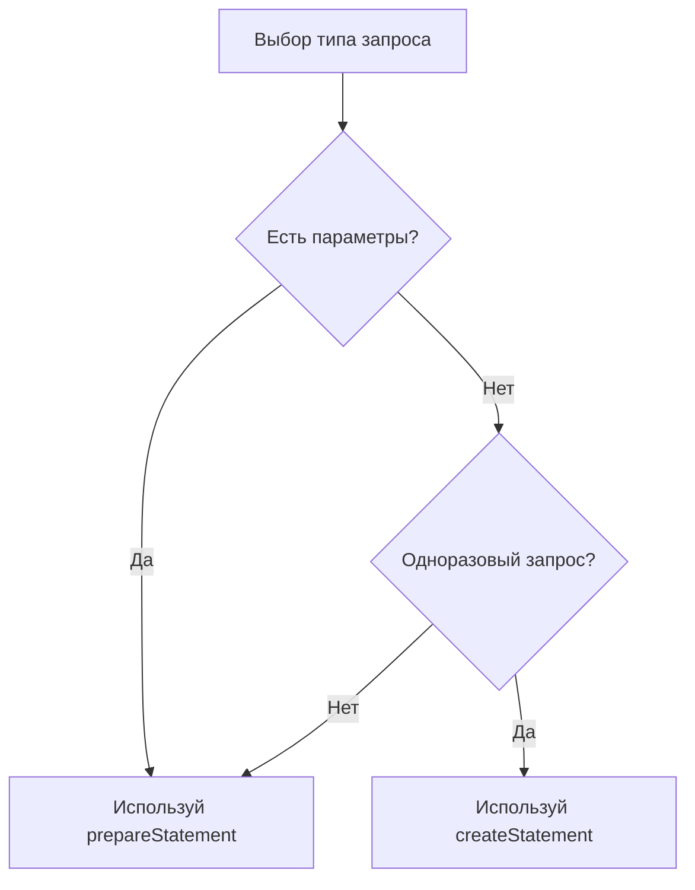

JdbcTemplate (Java Database Connectivity) — это класс, предоставляющий удобный способ работы с базой данных через SQL-запросы. Он инкапсулирует выполнение SQL, обработку ошибок и управление ресурсами.

## Алгоритм подключения:
1. Создать ConnectionManager
```java
package ru.Fab.repository.jdbc.utils;  
  
import java.sql.Connection;  
import java.sql.DriverManager;  
import java.sql.SQLException;  
  
public final class ConnectionManager {  
    public static final String URL_KEY = "db.url";  
    public static final String USERNAME_KEY = "db.username";  
    public static final String PASSWORD_KEY = "db.password";  
  
    public static Connection open() {  
        try {  
            return DriverManager.getConnection(PropertiesUtil.get(URL_KEY), PropertiesUtil.get(USERNAME_KEY), PropertiesUtil.get(PASSWORD_KEY));  
        } catch (SQLException e) {  
            throw new RuntimeException(e);  
        }  
    }  
  
    private ConnectionManager() {  
    }}
```
2. Создать application.properties
```
db.url=jdbc:postgresql://localhost:5432/postgres  
db.username=postgres  
db.password=10Dekabr1973
```
3. Создать PropertiesUtil
```java
package ru.Fab.repository.jdbc.utils;  
  
import java.io.IOException;  
import java.io.InputStream;  
import java.util.Properties;  
  
public final class PropertiesUtil {  
    private static final Properties PROPERTIES = new Properties();  
  
    static {  
        loadProperties();  
    }  
  
    private static void loadProperties() {  
        try (var inputStream = PropertiesUtil.class.getClassLoader().getResourceAsStream("application.properties")) {  
            PROPERTIES.load(inputStream);  
        } catch (IOException e) {  
            throw new RuntimeException(e);  
        }  
    }  
  
    public static String get(String key) {  
        return PROPERTIES.getProperty(key);  
    }  
  
    private PropertiesUtil() {  
    }}
```
4. Использовать запрос, где нам нужно
```java
package ru.Fab.repository.jdbc;  
  
import ru.Fab.repository.jdbc.utils.ConnectionManager;  
  
import java.sql.DriverManager;  
import java.sql.SQLException;
  
public class JdbcRunner {  
    public static void main(String[] args) throws SQLException {  
        String sql = """  
                SELECT * FROM info;  
                """;  
        try (var connection = ConnectionManager.open();  
             var statement = connection.prepareStatement(sql)) {  
            var result = statement.executeQuery();  
            while (result.next()) {  
                System.out.println(result.getLong("id"));  
            }  
        }  
    }  
}
```


## Разница между `createStatement❌` и `prepareStatement✅` в JDBC

### Основные различия
| Критерий                 | `createStatement` (Statement)        | `prepareStatement` (PreparedStatement)    |
| ------------------------ | ------------------------------------ | ----------------------------------------- |
| **Параметры**            | ❌ Не поддерживаются                  | ✅ Плейсхолдеры `?`                        |
| **Безопасность**         | ⚠️ Уязвим к SQL-инъекциям            | ✅ Защита от SQL-инъекций                  |
| **Производительность**   | ⏱️ Медленнее (компиляция каждый раз) | ⚡ Быстрее (компиляция один раз)           |
| **Повторное выполнение** | ❌ Неэффективно                       | ✅ Оптимально для циклов                   |
| **Пример использования** | DDL-операции (`CREATE`, `ALTER`)     | DML-операции (`SELECT`/`INSERT`/`UPDATE`) |


## CLOB, BLOB и т.д.

BLOB - Большие бинарные данные (картинки, аудио, видео и т.д.) → bytea
CLOB - Большие текстовые данные заданной кодировки. → TEXT

`.setMaxRows(100)` - Указывает максимальное количество возвращаемых строк в 1 запросе.
`.setFetchSize(100)` - Разбивает кол-во возвращаемых строк (по 100 строк в 1 итерации), не ограничивает максимум.
`.setQueryTimeout(10)` - Время ожидания по запросу (10 секунд). Если дольше, выбрасывается исключение.


