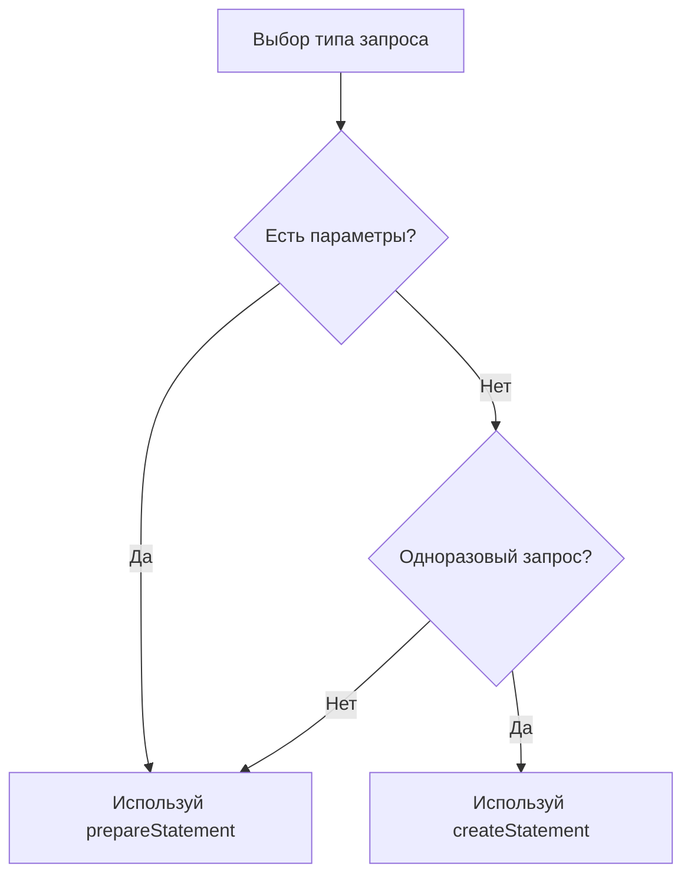

JdbcTemplate (Java Database Connectivity) — это класс, предоставляющий удобный способ работы с базой данных через SQL-запросы. Он инкапсулирует выполнение SQL, обработку ошибок и управление ресурсами.

## Алгоритм подключения:
1. Создать ConnectionManager
```java
package ru.Fab.repository.jdbc.utils;  
  
import java.sql.Connection;  
import java.sql.DriverManager;  
import java.sql.SQLException;  
  
public final class ConnectionManager {  
    public static final String URL_KEY = "db.url";  
    public static final String USERNAME_KEY = "db.username";  
    public static final String PASSWORD_KEY = "db.password";  
  
    public static Connection open() {  
        try {  
            return DriverManager.getConnection(PropertiesUtil.get(URL_KEY), PropertiesUtil.get(USERNAME_KEY), PropertiesUtil.get(PASSWORD_KEY));  
        } catch (SQLException e) {  
            throw new RuntimeException(e);  
        }  
    }  
  
    private ConnectionManager() {  
    }}
```
2. Создать application.properties
```
db.url=jdbc:postgresql://localhost:5432/postgres  
db.username=postgres  
db.password=10Dekabr1973
```
3. Создать PropertiesUtil
```java
package ru.Fab.repository.jdbc.utils;  
  
import java.io.IOException;  
import java.io.InputStream;  
import java.util.Properties;  
  
public final class PropertiesUtil {  
    private static final Properties PROPERTIES = new Properties();  
  
    static {  
        loadProperties();  
    }  
  
    private static void loadProperties() {  
        try (var inputStream = PropertiesUtil.class.getClassLoader().getResourceAsStream("application.properties")) {  
            PROPERTIES.load(inputStream);  
        } catch (IOException e) {  
            throw new RuntimeException(e);  
        }  
    }  
  
    public static String get(String key) {  
        return PROPERTIES.getProperty(key);  
    }  
  
    private PropertiesUtil() {  
    }}
```
4. Использовать запрос, где нам нужно
```java
package ru.Fab.repository.jdbc;  
  
import ru.Fab.repository.jdbc.utils.ConnectionManager;  
  
import java.sql.DriverManager;  
import java.sql.SQLException;
  
public class JdbcRunner {  
    public static void main(String[] args) throws SQLException {  
        String sql = """  
                SELECT * FROM info;  
                """;  
        try (var connection = ConnectionManager.open();  
             var statement = connection.prepareStatement(sql)) {  
            var result = statement.executeQuery();  
            while (result.next()) {  
                System.out.println(result.getLong("id"));  
            }  
        }  
    }  
}
```


# Разница между `createStatement` и `prepareStatement` в JDBC

## Основные различия
| Критерий                | `createStatement` (Statement)       | `prepareStatement` (PreparedStatement)   |
| ------------------------ | ----------------------------------- | ---------------------------------------- |
| **Параметры**            | ❌ Не поддерживаются                | ✅ Плейсхолдеры `?`                      |
| **Безопасность**         | ⚠️ Уязвим к SQL-инъекциям          | ✅ Защита от SQL-инъекций                |
| **Производительность**   | ⏱️ Медленнее (компиляция каждый раз) | ⚡ Быстрее (компиляция один раз)         |
| **Повторное выполнение** | ❌ Неэффективно                     | ✅ Оптимально для циклов                 |
| **Пример использования** | DDL-операции (`CREATE`, `ALTER`)    | DML-операции (`SELECT`/`INSERT`/`UPDATE`) |

## Детальное сравнение

### 🛠️ Назначение
<details>
<summary>Раскрыть детали</summary>

- **`createStatement()`**  
  Создает объект `Statement` для статических запросов без параметров:
  ```java
  Statement stmt = connection.createStatement();
  ResultSet rs = stmt.executeQuery("SELECT * FROM products");

- **`prepareStatement()`**  
    Создает `PreparedStatement` для параметризованных запросов:
    
    java
    

- PreparedStatement pstmt = connection.prepareStatement(
        "SELECT * FROM products WHERE price > ? AND category = ?"
    );
    

</details>
### 🔒 Безопасность
<details>
<summary>Раскрыть детали</summary>

- **Риск с `Statement`**:
  ```java
  // Уязвимость к SQL-инъекциям!
  String userInput = "1; DROP TABLE users;";
  String sql = "DELETE FROM users WHERE id = " + userInput; 
  Statement stmt = connection.createStatement();
  stmt.execute(sql); // Выполнит 2 команды!
  ```

- **Защита с `PreparedStatement`**:
  ```java
  String userInput = "1; DROP TABLE users;";
  PreparedStatement pstmt = connection.prepareStatement(
      "DELETE FROM users WHERE id = ?"
  );
  pstmt.setString(1, userInput); // Значение экранируется
  pstmt.executeUpdate(); // Безопасное выполнение
  ```
</details>

### ⚡ Производительность
<details>
<summary>Раскрыть детали</summary>

- **`Statement`** - перекомпиляция при каждом выполнении:
  ```java
  for (int i = 0; i < 1000; i++) {
      String sql = "INSERT INTO logs (msg) VALUES ('Entry " + i + "')";
      Statement stmt = connection.createStatement();
      stmt.executeUpdate(sql); // 1000 компиляций!
  }
  ```

- **`PreparedStatement`** - одноразовая компиляция:
  ```java
  PreparedStatement pstmt = connection.prepareStatement(
      "INSERT INTO logs (msg) VALUES (?)"
  );
  for (int i = 0; i < 1000; i++) {
      pstmt.setString(1, "Entry " + i);
      pstmt.executeUpdate(); // Повторное использование
  }
  ```
</details>

### 🏆 Рекомендации


- **Всегда используйте `PreparedStatement`** для:
  - Запросов с пользовательским вводом
  - Пакетной обработки данных
  - Часто повторяющихся запросов
  
- **Допустимо использовать `Statement`** для:
  - DDL-операций (`CREATE TABLE`, `ALTER INDEX`)
  - Администрирования БД
  - Статических запросов без переменных
