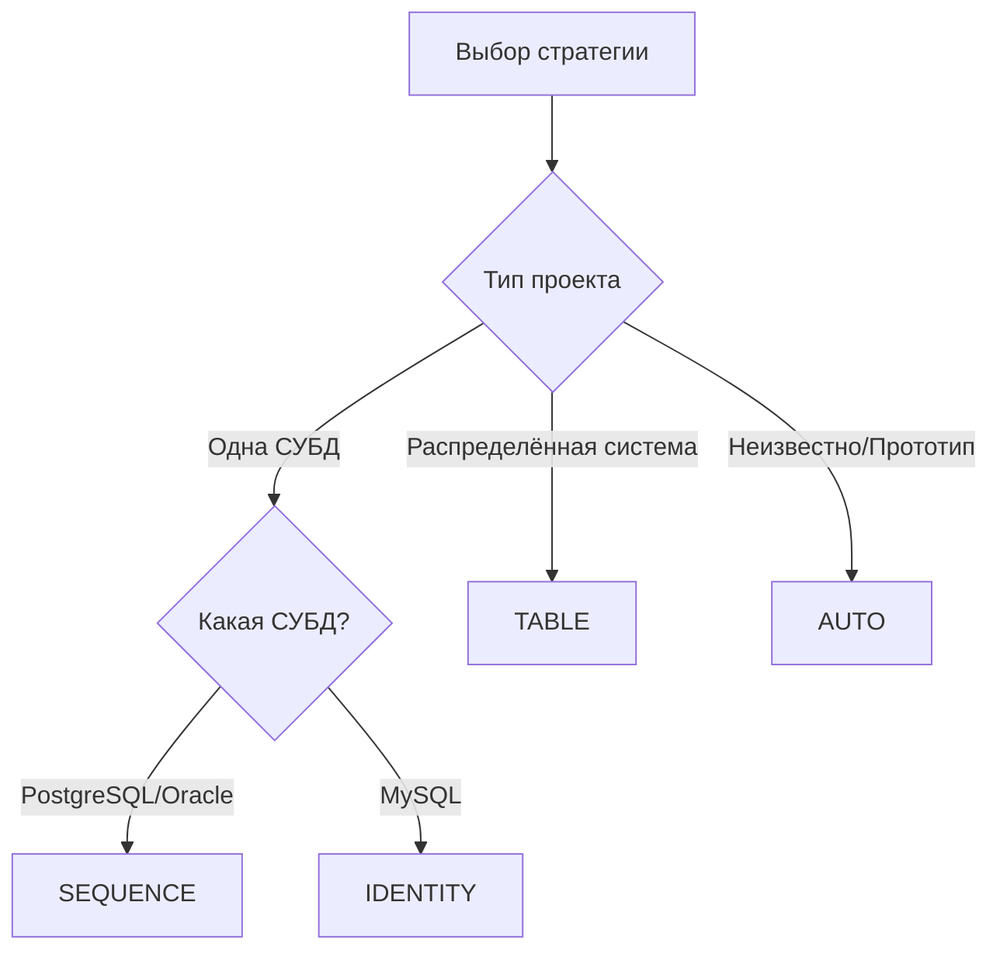

### Аннотация `@GeneratedValue`  
**Первичный ключ (PK)**  
- Уникальное значение  
- Не может быть `null`  

---

### Стратегии генерации PK  
#### 1. `GenerationType.AUTO` (по умолчанию)  
```java
@GeneratedValue(strategy = GenerationType.AUTO)
```  
- **Hibernate автоматически выбирает** стратегию на основе СУБД  
- Примеры:  
  - PostgreSQL → `SEQUENCE`  
  - MySQL → `IDENTITY`  

#### 2. `GenerationType.IDENTITY`  
```java
@GeneratedValue(strategy = GenerationType.IDENTITY)
```  
- **Автоинкремент средствами БД**  
- Поддержка:  
  - PostgreSQL: `SERIAL`/`BIGSERIAL`  
  - MySQL: `AUTO_INCREMENT`  
- ⚠️ Не поддерживает пакетную вставку  

#### 3. `GenerationType.SEQUENCE`  
```java
@GeneratedValue(
  strategy = GenerationType.SEQUENCE,
  generator = "my_sequence" // имя генератора
)
@SequenceGenerator(
  name = "my_sequence",
  sequenceName = "seq_name", // имя sequence в БД
  allocationSize = 1
)
```  
- **Требует создания sequence в БД**:  
```sql
CREATE SEQUENCE seq_name START 1 INCREMENT 1;
```  
- Оптимально для: PostgreSQL, Oracle, DB2  

#### 4. `GenerationType.TABLE`  
```java
@TableGenerator(
  name = "id_gen",
  table = "id_sequences",
  pkColumnName = "seq_name",
  valueColumnName = "seq_value",
  allocationSize = 50
)
@GeneratedValue(strategy = GenerationType.TABLE, generator = "id_gen")
```  
- **Использует отдельную таблицу**:  
```sql
CREATE TABLE id_sequences (
  seq_name VARCHAR(100) PRIMARY KEY,
  seq_value INT NOT NULL
);
```  
- Гарантирует уникальность в распределенных системах  
- ⚠️ Самый медленный вариант  

---

### Сравнение стратегий  
| Стратегия       | Когда использовать          | Плюсы                     | Минусы              |
|-----------------|----------------------------|--------------------------|---------------------|
| `IDENTITY`      | Простые проекты            | Простая настройка         | Нет batch-insert    |
| `SEQUENCE`      | PostgreSQL/Oracle          | Высокая производительность| Требует sequence    |
| `TABLE`         | Кросс-платформенные решения| Универсальность           | Низкая производит.  |
| `AUTO`          | Быстрое прототипирование   | Автоматизация             | Зависит от СУБД     |

---

### Диаграмма выбора стратегии  


---

### Примеры для PostgreSQL  
**Стратегия SEQUENCE**  
1. Создать sequence в БД:  
```sql
CREATE SEQUENCE employee_id_seq START 1 INCREMENT 1;
```  
2. Настройка сущности:  
```java
@Entity
public class Employee {
    @Id
    @GeneratedValue(
        strategy = GenerationType.SEQUENCE,
        generator = "employee_seq"
    )
    @SequenceGenerator(
        name = "employee_seq",
        sequenceName = "employee_id_seq",
        allocationSize = 1
    )
    private Long id;
}
```  

---

### Советы  
1. Для PostgreSQL всегда предпочитайте `SEQUENCE` вместо `IDENTITY`  
2. `allocationSize` в `@SequenceGenerator` ускоряет вставку через кэширование ID  
3. Избегайте `TABLE` если не нужна кросс-платформенность  

#hibernate #jpa #database #primary_key #generated_value

