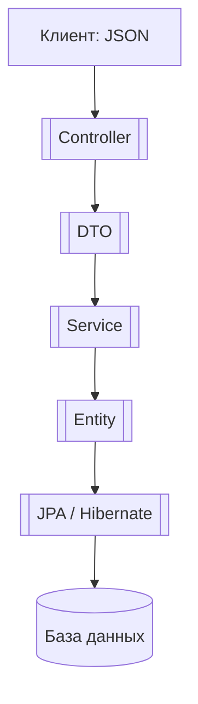

---

## 🧱 Основы и структура

### [[POJO]]

**Просто Java-класс** — ничего лишнего. Используется как основа для всего: [[DTO]], [[Entity]], JSON-объекты.

---

### [[Entity]]

**POJO-класс**, который отображает таблицу из базы данных. Использует аннотации [[@Entity]], [[@Table]], [[@Id]] и т.д.  
Работает через [[JPA]] и [[Hibernate]].

---

### [[DTO]]

**Объект для передачи данных**. Не тянет за собой базу данных. Используется между слоями, особенно от/к клиенту.  
Часто преобразуется из/в [[Entity]].

---

## 💾 Работа с БД

### [[JPA]]

**Стандарт** для работы с базой данных в Java. Определяет правила и аннотации (например, [[@Entity]]).

---

### [[Hibernate]]

**Реализация [[JPA]]**. Выполняет то, что описывает JPA — пишет SQL, делает связь с базой, кеширует и т.п.

---

### [[ORM]]

**Общая идея** — отображение объектов Java в таблицы базы данных и обратно.  
[[JPA]] и [[Hibernate]] — это инструменты реализации [[ORM]].

---

## 🌐 Веб-уровень

### [[Spring MVC]]

Фреймворк, который обрабатывает HTTP-запросы:

- получаем [[JSON]] → превращаем в [[DTO]]
    
- передаём в сервис
    
- сервис общается с БД через репозиторий
    
- возвращаем [[JSON]]
    

---

### [[JSP]] + [[JSTL]]

Старый способ рендеринга [[HTML]] на сервере. Использовались до [[REST API]]. Сейчас почти не применяются в Spring.

---

### [[HTML]]

Это просто формат отображения информации в браузере.  
Не относится к Java, но может быть сгенерирован через [[JSP]] или получен через API.

---

### [[JSON]]

**Формат передачи данных** между клиентом и сервером. В Spring ты часто отправляешь/принимаешь [[DTO]] как [[JSON]].

---

### [[JSON-POJO]]

**Преобразование между Java-объектом и [[JSON]]**. Используется библиотека Jackson.

---

## 🔄 Как всё связано (на примере Spring):

Обратно всё идёт тем же путём, только из базы → в JSON.

---

Если хочешь, я могу составить это в виде одной большой статьи или разложить в отдельную заметку по связям.