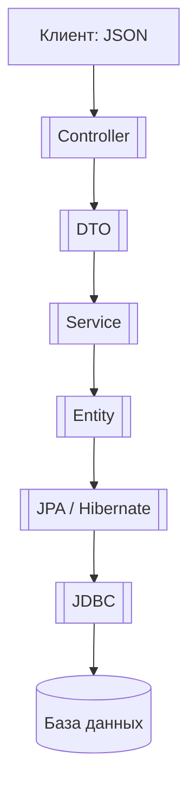

Вот переработанная версия твоей статьи, включая [[JDBC]] и сохранив компактный стиль:

---

## 🧱 Основы и структура

### [[POJO]]

**Просто Java-класс** — ничего лишнего.  
Используется как основа для всего: [[DTO]], [[Entity]], [[JSON]]-объекты.

---

### [[Entity]]

**POJO-класс**, который отображает таблицу из базы данных.  
Аннотации: [[@Entity]], [[@Table]], [[@Id]] и др.  
Работает через [[JPA]] и [[Hibernate]].

---

### [[DTO]]

**Объект для передачи данных**.  
Не тянет за собой базу данных.  
Используется между слоями, особенно от/к клиенту.  
Часто преобразуется из/в [[Entity]].

---

## 💾 Работа с БД

### [[JDBC]]

**Базовый способ** работы с базой в Java.  
Ты сам пишешь SQL, управляешь соединением и результатами.

- Явное управление `Connection`, `PreparedStatement`, `ResultSet`.
    
- [[JPA]] и [[Hibernate]] используют JDBC внутри.
    

Пример:

```java
Connection conn = DriverManager.getConnection(url, user, pass);
PreparedStatement stmt = conn.prepareStatement("SELECT * FROM users");
ResultSet rs = stmt.executeQuery();
```

---

### [[JPA]]

**Стандарт** для работы с базой в Java.  
Определяет аннотации и правила (например, [[@Entity]], [[@OneToMany]]).

---

### [[Hibernate]]

**Реализация [[JPA]]**.  
Сам генерирует SQL, управляет сессиями, кэширует и т.д.  
Работает поверх [[JDBC]].

---

### [[ORM]]

**Общая идея**: отображать Java-объекты в таблицы и обратно.  
[[JPA]] и [[Hibernate]] — инструменты реализации [[ORM]].

---

## 🌐 Веб-уровень

### [[Spring MVC]]

Фреймворк, который обрабатывает HTTP-запросы:

- получает [[JSON]] → превращает в [[DTO]]
    
- передаёт в сервис
    
- сервис работает с [[Entity]] через репозиторий
    
- возвращает [[JSON]]
    

---

### [[JSP]] + [[JSTL]]

Старый способ рендерить [[HTML]] на сервере.  
Применялся до [[REST API]].  
Сейчас почти не используется в Spring.

---

### [[HTML]]

Формат отображения информации в браузере.  
Не относится к Java, но может быть:

- сгенерирован через [[JSP]]
    
- или получен с сервера по API
    

---

### [[JSON]]

**Формат передачи данных** между клиентом и сервером.  
В Spring обычно отправляется/принимается как [[DTO]].

---

### [[JSON-POJO]]

**Преобразование между Java-объектом и [[JSON]]**.  
Используется библиотека Jackson:

```java
ObjectMapper mapper = new ObjectMapper();
String json = mapper.writeValueAsString(myDto);
```

---

## 🔄 Как всё связано (на примере Spring)



Обратно всё идёт тем же путём: из БД → в JSON.

---
