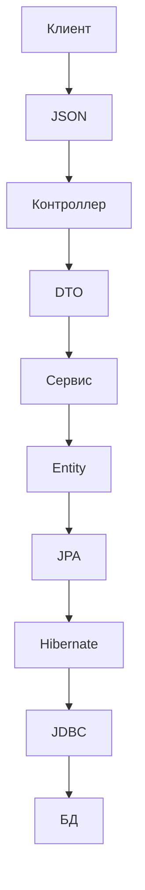
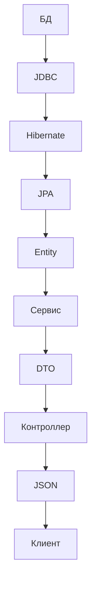

## 🧱 Основы и структура

### [[POJO]]

**Просто Java-класс** — ничего лишнего.  
Основа для [[DTO]], [[Entity]], [[JSON]]-объектов.

---
### [[Entity]]

**POJO-класс**, который отображает таблицу из базы данных.  
Работает через [[JPA]] и [[Hibernate]].

Аннотации:

- `@Entity`, `@Table`, `@Id`
    
- `@OneToMany`, `@ManyToOne` и др.
    

---

### [[DTO]]

**Объект для передачи данных**.  
Не связан с БД. Используется между слоями.  
Часто создаётся на основе [[Entity]].

---

## 💾 Работа с БД

### [[JDBC]]

**Базовый способ** работы с БД.  
Ты сам пишешь SQL, управляешь соединением и результатами.

Пример:

```java
Connection conn = DriverManager.getConnection(url, user, pass);
PreparedStatement stmt = conn.prepareStatement("SELECT * FROM users");
ResultSet rs = stmt.executeQuery();
```

---

### [[JPA]]

**Стандарт** описания связей между объектами и таблицами через аннотации.
**JPA** — это **чертёж и правила строительства**.

- Не работает сам — нужен провайдер, например [[Hibernate]].
    

---

### [[Hibernate]]

**Реализация JPA**.  
**Hibernate** — это **строительная бригада с инструментами**.
Автоматически генерирует SQL, управляет сессиями, кэширует.  
Работает поверх [[JDBC]].

---

### [[ORM]]

**Object-Relational Mapping** — общая идея:  
отображать Java-объекты в строки таблиц и обратно.

- [[JPA]] и [[Hibernate]] — реализации ORM.
    

---

## 🌐 Веб-уровень

### [[Spring MVC]]

Фреймворк, который обрабатывает HTTP-запросы. Типичный путь:

- [[JSON]] → [[DTO]] → контроллер
    
- передаём в сервис
    
- работаем с [[Entity]] через репозиторий
    
- возвращаем [[JSON]]
    

---

### [[JSP]] + [[JSTL]]

**Старый способ** вывода [[HTML]] на сервере.  
Сейчас почти не используется в Spring (вместо него [[REST API]] и фронтенд или [[Thymeleaf]]).

---

### [[HTML]]

Формат для отображения в браузере.  
Может быть сгенерирован на сервере или получен с API.

---

### [[JSON]]

Формат обмена данными между клиентом и сервером.  
В Spring работает в паре с [[DTO]].

---

### [[JSON-POJO]]

Автоматическое преобразование между [[JSON]] и Java-объектами с помощью Jackson.

```java
ObjectMapper mapper = new ObjectMapper();
String json = mapper.writeValueAsString(myDto);
MyDto dto = mapper.readValue(json, MyDto.class);
```

---

## 🔄 Как всё связано (на примере Spring)

### 🔁 Часть 1: от клиента до БД



**Что происходит:**

- Клиент отправляет JSON-запрос
    
- Контроллер превращает его в DTO
    
- Сервис работает с Entity
    
- Hibernate преобразует действия в SQL
    
- JDBC отправляет запрос в базу
    

---

### 🔁 Часть 2: из БД к клиенту



**Что происходит:**

- Данные читаются из БД
    
- Hibernate собирает Entity
    
- Сервис преобразует в DTO
    
- Контроллер сериализует в JSON и отправляет клиенту
    

---