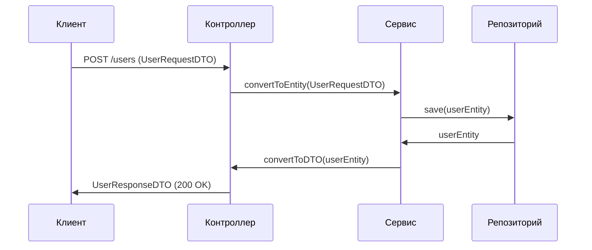

### 📦 **DTO (Data Transfer Object) для Java-разработчика** 

**Простыми словами:** DTO — это "контейнер для данных", который используется для **безопасной передачи информации** между слоями приложения (например, от контроллера к клиенту).

---

#### 🧠 **Зачем нужен DTO?**
1. **Изоляция модели**  
   - Не показывать клиенту внутреннюю структуру БД (например, поля `password` или `creation_date`)
2. **Оптимизация данных**  
   - Объединять данные из нескольких сущностей (например, `User + Profile`)
3. **Контроль версий API**  
   - Независимое изменение API и модели данных
4. **Валидация**  
   - Точечная проверка входящих данных

---

#### ⚙️ **Как выглядит DTO?**
```java
// Entity (внутренняя модель БД)
@Entity
public class User {
    private Long id;
    private String username;
    private String password; // ❌ Нельзя показывать клиенту!
    private LocalDateTime createdAt;
}

// DTO для передачи клиенту
public class UserDTO {
    private Long id;
    private String username;
    private String joinDate; // Форматированная дата
    
    // Конструктор из Entity
    public UserDTO(User user) {
        this.id = user.getId();
        this.username = user.getUsername();
        this.joinDate = user.getCreatedAt().format(DateTimeFormatter.ISO_DATE);
    }
}
```

---

#### 🔄 **Поток данных в Spring MVC**


---

#### 🛠 **Практика: 3 типа DTO**
1. **Request DTO** — для входящих данных:
```java
public class UserRequestDTO {
    @NotBlank
    private String username;
    
    @Email
    private String email;
}
```

2. **Response DTO** — для исходящих данных:
```java
public class UserResponseDTO {
    private UUID publicId;
    private String displayName;
}
```

3. **Internal DTO** — для обмена между сервисами.

---

#### 🧩 **Инструменты работы с DTO**
1. **MapStruct** — генерация мапперов:
```java
@Mapper
public interface UserMapper {
    UserMapper INSTANCE = Mappers.getMapper(UserMapper.class);
    
    UserDTO toDto(User user);
}
```

2. **Lombok** — сокращение кода:
```java
@Data // Геттеры/сеттеры
@Builder // Паттерн Builder
@NoArgsConstructor
@AllArgsConstructor
public class ProductDTO {
    private String name;
    private BigDecimal price;
}
```

3. **Record (Java 14+)** — для неизменяемых DTO:
```java
public record UserDTO(Long id, String username) {}
```

---

#### 💡 **Лучшие практики**
1. **Не используйте Entity в контроллерах!**  
   Всегда преобразуйте Entity → DTO перед отправкой клиенту.

2. **Валидируйте RequestDTO**:
```java
@PostMapping
public ResponseEntity<?> create(@Valid @RequestBody UserRequestDTO dto) {...}
```

3. **Используйте разные DTO для разных сценариев**:
   - `UserRegistrationDTO`
   - `UserProfileDTO`
   - `AdminUserDTO`

---

#### ❌ **Типичные ошибки**
```java
// Плохо: Возврат Entity из контроллера
@GetMapping("/{id}")
public User getUser(@PathVariable Long id) {
    return userService.findById(id); // Пароль утечёт!
}

// Хорошо: Использование DTO
@GetMapping("/{id}")
public UserDTO getUser(@PathVariable Long id) {
    return userMapper.toDto(userService.findById(id));
}
```

---

#### 📚 **Когда использовать?**
| Сценарий | Рекомендация |
|----------|--------------|
| REST API | Всегда |
| MVC с Thymeleaf | Для сложных форм |
| Микросервисы | Обязательно |
| Внутренние вызовы | Опционально |

> 🔗 **Дополнительно**:  
> - [MapStruct Guide](https://mapstruct.org/documentation/stable/reference/html/)  
> - [Spring Data REST and DTOs](https://spring.io/blog/2018/09/27/what-s-new-in-spring-data-lovelace)  
> - [DTO vs Value Object](https://martinfowler.com/bliki/LocalDTO.html)  

#java #dto #spring #best_practices