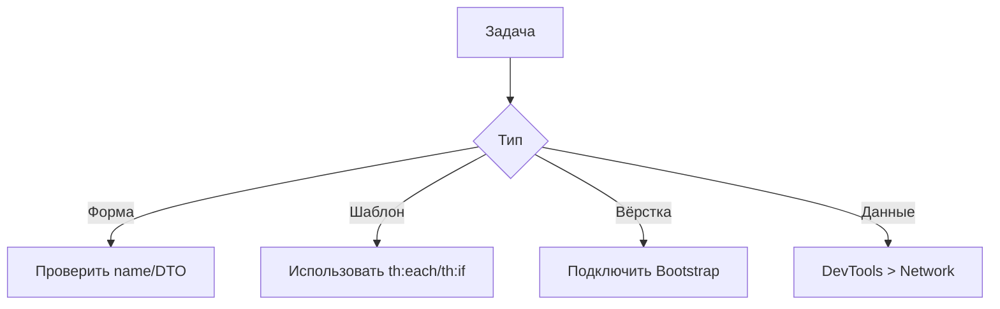

#### 🧱 **I. Основы HTML (обязательный минимум)**  
**Что нужно знать:**  
```html
<!-- Формы (важно для Spring MVC!) -->
<form action="/submit" method="POST">
  <input type="text" name="username">
  <input type="password" name="password">
  <button type="submit">Отправить</button>
</form>

<!-- Семантические теги -->
<header>Лого</header>
<main>Контент</main>
<footer>Контакты</footer>
```

**Запомнить:**  
- Атрибут `name` в формах → имя поля в DTO на бэкенде  
- `th:action`/`th:object` для интеграции с Thymeleaf  

---

#### 🎨 **II. CSS: Только критичное**  
**Базовые концепции:**  
```css
/* Селекторы по классам (БЭМ-нотация) */
.form__input--error { 
  border-color: red;
}

/* Flexbox для выравнивания форм */
.form-container {
  display: flex;
  justify-content: center;
}
```

**Важно для Java-девов:**  
- Используйте CSS-фреймворки! (Bootstrap, Tailwind)  
- Достаточно понимать:  
  - Отступы (`margin/padding`)  
  - Позиционирование (`position: relative/absolute`)  
  - Flexbox для простых макетов  

---

#### ⚙️ **III. Шаблонизаторы (JSP/Thymeleaf)**  
**Ключевые операции:**  
```jsp
<!-- JSP + JSTL -->
<c:forEach items="${users}" var="user">
  <tr>${user.name}</tr>
</c:forEach>

<!-- Thymeleaf -->
<form th:action="@{/save}" th:object="${user}">
  <input th:field="*{name}">
</form>
```

**Must-know:**  
| Действие               | JSTL                  | Thymeleaf             |
|------------------------|-----------------------|-----------------------|
| Итерация               | `<c:forEach>`         | `th:each`             |
| Условия                | `<c:if>`              | `th:if`               |
| URL                    | `<c:url>`             | `@{...}`              |
| Формы                  | `form:form` (Spring)  | `th:object`           |

---

#### 🔄 **IV. Работа с формами (Spring MVC)**  
**Связка HTML + Java:**  
```java
// DTO класс
public class UserDTO {
  private String username;
  // геттеры/сеттеры
}

// Контроллер
@PostMapping("/register")
public String register(@ModelAttribute UserDTO userDto) {
  // обработка данных
}
```
```html
<form th:action="@{/register}" th:object="${userDto}">
  <input th:field="*{username}" type="text">
</form>
```

**Ошибки новичков:**  
1. Несовпадение `name` в HTML и имени поля в DTO  
2. Отсутствие `@ModelAttribute` в контроллере  
3. Неправильные HTTP-методы (`GET` вместо `POST`)

---

#### 🛠️ **V. Инструменты и отладка**  
**Когда фронтенд не работает:**  
1. **Проверьте данные запроса:**  
   - Chrome DevTools → Вкладка `Network`  
   - Смотрите `Form Data` в POST-запросах  

2. **Типичные ошибки интеграции:**  
   ```log
   // Spring ошибка при биндинге
   Field error in object 'userDto' on field 'username': rejected value [null]
   ```
   Решение:  
   - Проверить `th:field="*{username}"`  
   - Убедиться что в DTO есть сеттер `setUsername()`  

3. **Обновление шаблонов:**  
   - Для Thymeleaf: `spring.thymeleaf.cache=false` в `application.properties`  
   - Для JSP: очистка папки `target` и перезапуск Tomcat  

---

### 💡 **Чеклист для Java-разработчика**  


**Готовые решения:**  
1. Формы авторизации → Spring Security  
2. Сложные таблицы → DataTables.js + AJAX  
3. Валидация → `@Valid` в Spring + Hibernate Validator  

> 🔗 **Полезное**:  
> - [Bootstrap Cheat Sheet](https://bootstrap-cheatsheet.themeselection.com/)  
> - [Thymeleaf Docs](https://www.thymeleaf.org/doc/tutorials/3.1/usingthymeleaf.html)  
> - [Spring Form Handling](https://spring.io/guides/gs/handling-form-submission/)  

#java_web #spring_mvc #thymeleaf #jsp #frontend_for_java