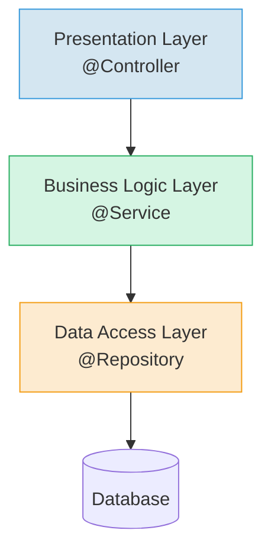

[[HTML]]
[[JSP]]
[[JSTL]]
MVC - это паттерн проектирования, разделяющий архитектуру приложения на три компонента.

**Front Controller** — это тоже паттерн проектирования, который обеспечивает единую точку входа в приложение. В Spring **Front Controller** также известен под названием **Dispatcher Servlet**.

**Controller** — это «мозг» нашего приложения. Четких границ нет, сюда входят и классы-контроллеры, и классы-сервисы, и классы-репозитории. В общем, все то, что содержит какую-то бизнес-логику.

**Model** — это просто данные, полученные от пользователя или из БД.

**View** — это веб-страницы, которые могут обогащаться данными из Model и возвращаться пользователю. Обычно веб-страницы представлены в виде HTML, JSP или Thymeleaf-страниц.

- Model - ответственен за данные приложения и за работу с этими данными.
- View - ответственен за взаимодействие с пользователем, отображает данные и определяет внешний вид приложения.
- Controller - отвечает за связь между Model и View.

---

**Аннотация `@Controller`** — это специализированный `@Component`, который дополнительно сообщает `DispatcherServlet`-у о том, что готов обрабатывать входящие запросы по URL-ам, которые указаны в классе при помощи аннотации `@RequestMapping`.

**Аннотация `@RequestMapping`** связывает метод контроллера с URL-ом веб-приложения.

Аннотацию `@RequestMapping` также можно использовать и для **всего класса контроллера**. В таком случае указанный URL будет использоваться в качестве **префикса** для всех методов, помеченных `@RequestMapping`.

---

<mark style="background: #FFB86CA6;">Servlet</mark> - это низкоуровневое решение с помощью которого мы можем на Java обрабатывать входящие HTTP запросы нашего Web приложения. Используется класс-наследник от Servlet, в котором описано, как обрабатывать конкретные urlы.

---
### 🌐 Presentation Layer (Уровень представления)
*Также известен как Web Layer*  
**Назначение**: Обеспечивает взаимодействие с пользователем.  
**Компоненты**:  
- Контроллеры (классы с `@Controller`)  
- Обработка HTTP-запросов  
- Валидация входящих данных  

### ⚙️ Business Logic Layer (Уровень бизнес-логики)
**Назначение**: Содержит функциональные алгоритмы приложения.  
**Функции**:  
- Выполнение бизнес-правил  
- Посредник между Presentation и Data Access Layers  
- Содержит сервисы (`@Service`)  
- Транзакционное управление  

### 🗄️ Data Access Layer (Уровень доступа к данным)
*Также известен как Persistence Layer*  
**Назначение**: Взаимодействие с хранилищами данных.  
**Реализация**:  
- Предоставляет CRUD-операции (Create, Read, Update, Delete)  
- Содержит репозитории (`@Repository`)  
- ORM-взаимодействие (Hibernate, JPA)  
- Абстрагирование от СУБД

---

![[Pasted image 20250724111025.png]]

---

![[Pasted image 20250724115040.png]]

---

![[Pasted image 20250724120611.png]]