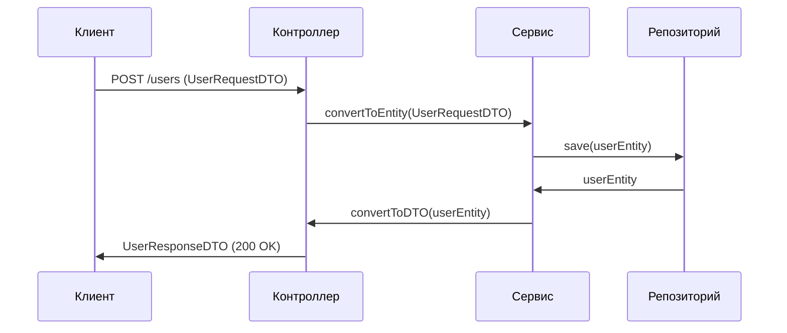

### 📦 **DTO (Data Transfer Object) для Java-разработчика**

**Простыми словами:** DTO — это "контейнер для данных", который используется для **безопасной передачи информации** между слоями приложения (например, от контроллера к клиенту или обратно).

---

#### 🧠 **Зачем нужен DTO?**

1. **🛡 Изоляция модели**  
    — Не показывать клиенту внутреннюю структуру БД (например, поля `password` или `createdAt`).
    
2. **⚡ Оптимизация данных**  
    — Объединять поля из нескольких сущностей (например, `User + Profile` → `UserProfileDTO`).
    
3. **🔧 Контроль версий API**  
    — Позволяет менять API независимо от внутренней модели.
    
4. **🧹 Валидация входящих данных**  
    — DTO можно проверять с помощью аннотаций (`@Valid`, `@NotNull`, `@Email` и т.д.).
    

---

#### ⚙️ **Как выглядит DTO?**

```java
// Entity (внутренняя модель БД)
@Entity
public class User {
    private Long id;
    private String username;
    private String password; // ❌ Нельзя показывать клиенту!
    private LocalDateTime createdAt;
}

// DTO для передачи клиенту
public class UserDTO {
    private Long id;
    private String username;
    private String joinDate; // Форматированная дата

    // Конструктор из Entity
    public UserDTO(User user) {
        this.id = user.getId();
        this.username = user.getUsername();
        this.joinDate = user.getCreatedAt().format(DateTimeFormatter.ISO_DATE);
    }
}
```

---

#### 🔄 **Поток данных в Spring MVC**



---

#### 🛠 **Инструменты работы с DTO**

1. **🧰 MapStruct** — автоматическое создание мапперов:
    

```java
@Mapper
public interface UserMapper {
    UserMapper INSTANCE = Mappers.getMapper(UserMapper.class);
    
    UserDTO toDto(User user);
    User toEntity(UserDTO dto);
}
```

2. **⚡ Lombok** — сокращение шаблонного кода:
    

```java
@Data
@Builder
@NoArgsConstructor
@AllArgsConstructor
public class ProductDTO {
    private String name;
    private BigDecimal price;
}
```

3. **📦 Record (Java 14+)** — простой способ описания неизменяемого DTO:
    

```java
public record UserDTO(Long id, String username) {}
```

---

#### 💬 **Типы DTO в практике**

1. **📥 Request DTO** — используется в `@RequestBody` контроллеров:
    

```java
public class UserRequestDTO {
    @NotBlank
    private String username;

    @Email
    private String email;
}
```

2. **📤 Response DTO** — используется для возврата клиенту:
    

```java
public class UserResponseDTO {
    private UUID publicId;
    private String displayName;
}
```

3. **🔄 Internal DTO** — для обмена между слоями или микросервисами внутри системы.
    

---

#### ✅ **Лучшие практики**

- 🔒 **Никогда не возвращайте Entity напрямую из контроллеров**  
    → преобразовывайте в DTO для безопасности и стабильности API.
    
- 🧪 **Валидируйте входящие DTO** через `@Valid`:
    

```java
@PostMapping
public ResponseEntity<?> register(@Valid @RequestBody UserRequestDTO dto) { ... }
```

- 🧩 **Используйте разные DTO для разных сценариев**:
    
    - `UserRegistrationDTO`
        
    - `UserProfileDTO`
        
    - `AdminUserDTO`
        

---

#### 🚫 **Типичные ошибки**

```java
// ❌ Плохо: возврат Entity (может "утечь" пароль)
@GetMapping("/{id}")
public User getUser(@PathVariable Long id) {
    return userService.findById(id);
}

// ✅ Хорошо: возвращается DTO
@GetMapping("/{id}")
public UserDTO getUser(@PathVariable Long id) {
    return userMapper.toDto(userService.findById(id));
}
```

---

#### 📚 **Когда использовать DTO?**

|Сценарий|Рекомендация|
|---|---|
|🌐 REST API|Всегда|
|🧾 Spring MVC + JSP|При сложных формах|
|🔗 Микросервисы|Обязательно|
|🧭 Внутренние вызовы|Опционально|

---

#### 🔗 **Ссылки и смежные понятия**

- [🔍 Entity](obsidian://open?vault=your-vault&file=JPA)
    
- [🗃️ ORM](obsidian://open?vault=your-vault&file=ORM)
    
- [🌐 Spring MVC](obsidian://open?vault=your-vault&file=Spring%20MVC)
    
- [🧭 JPA](obsidian://open?vault=your-vault&file=JPA)
    
- [🧱 JSON-POJO](obsidian://open?vault=your-vault&file=JSON-POJO)
    

---

#### 📎 **Дополнительные ресурсы**

- 📘 [MapStruct Docs](https://mapstruct.org/documentation/stable/reference/html/)
    
- 🧰 [Spring Blog: DTO & REST](https://spring.io/blog/2018/09/27/what-s-new-in-spring-data-lovelace)
    
- 🧠 [Martin Fowler — Local DTO](https://martinfowler.com/bliki/LocalDTO.html)
    

---

#java #spring #dto #mapstruct #mvc #bestpractices