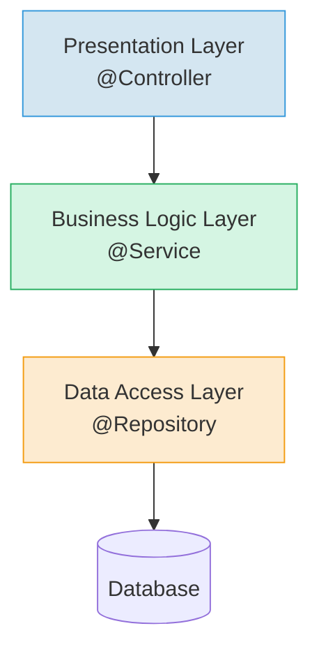

[[HTML]]
[[JSP]]
[[JSTL]]
[[DTO]]
[[ObsidianGit/Программирование/Spring/Spring MVC/JSON-POJO]]
**Spring MVC** — это модуль веб-фреймворка **Spring**, предназначенный для создания гибких и масштабируемых веб-приложений на Java. Он реализует архитектурный паттерн **Model-View-Controller (MVC)**, разделяя логику приложения на три компонента для упрощения разработки и тестирования.
### 🧱 **Архитектура MVC**  
**Model-View-Controller** — паттерн разделения приложения на три компонента:

|Компонент|Роль|Примеры|
|---|---|---|
|**Model**|Данные приложения|Объекты из БД, формы, DTO|
|**View**|Отображение данных|JSP, Thymeleaf, HTML-шаблоны|
|**Controller**|"Мозг" системы|Классы с `@Controller`, сервисы|

**Ключевая фишка:**  


---
### 🚪 **Front Controller: DispatcherServlet**  
- **Единая точка входа** для всех запросов  
- Маршрутизирует запросы к нужным контроллерам  
- Автоматически настраивается в Spring Boot  
---

### 🏗️ **Трехуровневая архитектура**  


#### 1. 🌐 **Presentation Layer (Уровень представления)**  
- **Что делает:** Принимает HTTP-запросы, возвращает HTML  
- **Аннотации:** `@Controller`  
- **Инструменты:**  
  - `@RequestMapping` для связи URL → метод  
  - JSP/JSTL/Thymeleaf для шаблонов  

**Пример:**  
```java
@Controller
@RequestMapping("/users")
public class UserController {
    @GetMapping("/list")
    public String getUsers(Model model) {
        model.addAttribute("users", userService.getAll());
        return "users/list";
    }
}
```

#### 2. ⚙️ **Business Logic Layer (Бизнес-логика)**  
- **Что делает:** Содержит "интеллект" приложения  
- **Аннотации:** `@Service`  
- **Задачи:**  
  - Валидация данных  
  - Транзакции  
  - Работа с несколькими репозиториями  

#### 3. 🗄️ **Data Access Layer (Работа с данными)**  
- **Что делает:** Взаимодействует с БД  
- **Аннотации:** `@Repository`  
- **Паттерны:**  
  - DAO (Data Access Object)  
  - CRUD-операции  
  - ORM (Hibernate/JPA)  

---

### 🔖 **Ключевые аннотации Spring**  
| Аннотация | Слой | Особенность |  
|-----------|------|-------------|  
| `@Controller` | Presentation | Обрабатывает HTTP-запросы |  
| `@Service` | Business | Содержит бизнес-логику |  
| `@Repository` | Data Access | Преобразует JDBC-исключения |  

**Важно:** Все три — специализированные версии `@Component`!

---

### 🛠️ **Типичные проблемы и решения**  
*Когда изменения в коде/CSS/JSP не применяются:*  

1. **Очистка папки `target`**  
   - Удалите красную папку `target` в проекте (ПКМ → Delete)  
   - *Почему:* Там хранятся скомпилированные файлы  

2. **Пересборка проекта**  
   - `Build` → `Rebuild Project` в IDEA  
   - *Когда:* После изменений в Java-коде  

3. **Сброс кеша браузера**  
   - `Ctrl+Shift+Del` → "Кеш изображений и файлов"  
   - **Hard Refresh:** `Ctrl+F5`  
   - *Когда:* Изменения в HTML/CSS/JS не видны  

4. **Сброс кеша IDEA**  
   - `File` → `Invalidate Caches...` → `Invalidate and Restart`  
   - *Когда:* Странное поведение IDE  

**Профилактика:**  


---

### 💡 **Лучшие практики**  
1. Для класса контроллера используйте `@RequestMapping` как префикс:  
   ```java
   @Controller
   @RequestMapping("/products") // Все методы будут /products/...
   public class ProductController { ... }
   ```

2. Разделяйте ответственность:  
   - Контроллеры → работа с HTTP  
   - Сервисы → бизнес-логика  
   - Репозитории → работа с БД  

3. Настройте авто-пересборку в IDEA:  
   `Settings` → `Build, Execution, Deployment` → `Compiler` → ✅ `Build project automatically`

---

> **Golden Rule:**  
> Если что-то не работает — 90% проблем решаются:  
> 1. Удалением папки `target`  
> 2. Hard Refresh в браузере (`Ctrl+F5`)  
> 3. Перезапуском Tomcat